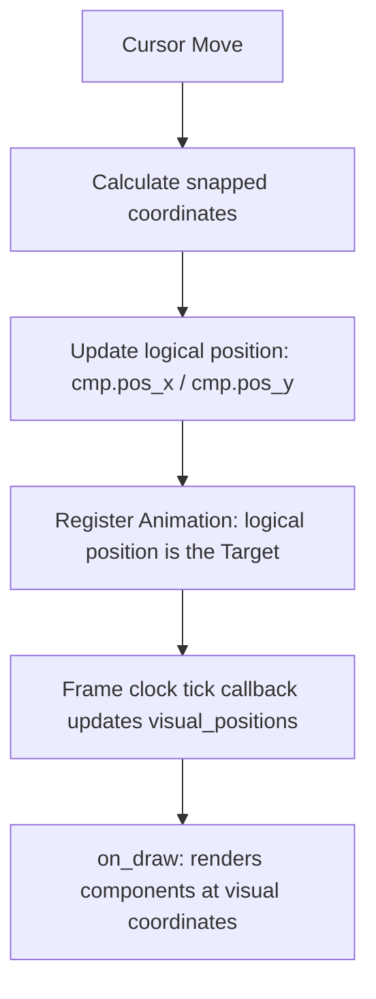

# GGate Canvas Component Animation Plan

This document outlines the design, feasibility, and implementation plan for introducing smooth animated transitions (gliding) when logic components and nets snap to the grid in GGate.

---

## 1. Feasibility Assessment

### Verdict: YES (Highly Feasible)

Animating component and net moves is fully feasible under the current GGate architecture without requiring fundamental structural changes to the logic simulation or the rendering pipeline.

### Architectural Enablers

1. **Draw loop structure (`ggate/DrawArea.py:on_draw`)**:
   In `on_draw` (lines 351–386), the cached offscreen surface (`self.mpixbuf`) is **only** used to cache the background canvas color and the grid lines (lines 353–373). The components and nets are drawn *directly* on top of the rendered background onto the active widget context `cr` during every frame redraw (line 386):
   ```python
   [self.draw_component(cmp, cr, layout) for cmp in self.circuit.components]
   ```
   This is a massive performance advantage: animating components only requires updating their visual coordinates and calling `self.queue_draw()`. The background grid does **not** need to be invalidated or re-rendered on the CPU, making redraws extremely cheap.
2. **Floating-Point Cairo rendering**:
   Cairo drawing functions (such as `cr.translate(x, y)` used to position gates) natively accept floating-point values. This allows smooth, sub-pixel animations.
3. **Decoupled Grid Logic**:
   Grid snapping calculations during drag/move are computed using basic modular arithmetic (`ddx - ddx % self.grid_step`) inside `on_motion`. Net splitting and connection logic are only evaluated on mouse release (`on_button_release_primary`). Thus, visual rendering during motion can be interpolated independently without breaking the underlying logical integrity of the circuit.

### Friction Points & Challenges

1. **Net representation**:
   Logic gates are persistent objects subclassing `BaseComponent`, making it easy to store additional states. However, net segments are raw Python lists (`[const.component_net, x1, y1, x2, y2]`) that are modified in-place during dragging and frequently deleted, split, or combined on drop. The animation manager must track these lists safely via object references and clean them up when they are removed.
2. **History State deep-copy (`ggate/CircuitManager.py:undo/redo`)**:
   Undo and Redo actions replace the entire list of components with deep copies (`self.components = copy.deepcopy(...)`). This changes all component object references instantly. Consequently, any active animation mapping keying off component object references will become stale.

---

## 2. Core Mechanism

The animation loop will be driven by the GTK4 Frame Clock rather than CPU-blocking timers (like `time.sleep` or high-overhead Python threads).

### The Recommended Driver: `Gtk.Widget.add_tick_callback`

To animate, we will register a tick callback on the `Gtk.DrawingArea` widget using:
```python
self.tick_id = self.drawingarea.add_tick_callback(self._on_tick)
```
- **Frame-Rate Alignment**: The callback is called by GTK in sync with the GDK frame clock, matching the monitor's vertical refresh rate (v-sync). This ensures maximum fluidity.
- **Microsecond Precision**: The tick callback receives a `Gdk.FrameClock` object. Calling `frame_clock.get_frame_time()` returns monotonic microseconds, providing a jitter-free delta-time calculation.
- **Automatic Lifecycle**: Returning `GLib.SOURCE_REMOVE` (or `False` in Python) automatically removes the callback, avoiding idle CPU usage when no animations are active.

### Alternative: Libadwaita `Adw.TimedAnimation` / `Adw.SpringAnimation`

We evaluated using Libadwaita animations:
* **Pros**: Native C implementation, built-in physics curves (`Adw.SpringAnimation` behaves like a physical spring), and clean target-progress tracking.
* **Cons**:
  * In PyGObject, creating a target callback via `Adw.CallbackAnimationTarget` introduces wrapper overhead, especially when animating dozens of gates and wires simultaneously.
  * Starting/stopping dozens of concurrent animations creates multiple timers that are hard to coordinate and centralize.
  * Adding references to `Adw` animation objects decreases portability if GGate components are ever rendered outside Adw widgets.

**Recommendation**: Use a centralized `Gtk.Widget.add_tick_callback` on the canvas. It maintains a registry of all active visual animations and handles them in a single Python loop, offering superior control and minimal overhead.

---

## 3. Design: Logical vs. Visual Decoupling

To prevent animations from affecting circuit simulation, connections, or save-states, we must decouple the **logical position** (snapped integers) from the **visual position** (interpolated floats).



### Visual Position Registry
We will introduce an animation registry dictionary inside `DrawArea`:
```python
self.visual_positions = {}  # Key: component obj or net list ref -> VisualState
```

- When a component/net `c` is drawn, `DrawArea` queries `self.visual_positions`.
- If a visual state exists, it uses those coordinates for rendering (e.g. translating the Cairo context).
- If it does not exist, it defaults to the logical position `(c[1].pos_x, c[1].pos_y)` and renders instantly.

### Redraw Management
No modifications are required for the cached background surface `self.mpixbuf`. The background and grid lines remain cached. During an animation tick, we update the visual positions and call `self.queue_draw()`. The widget blits the background cache and draws all components dynamically at their current visual positions.

---

## 4. Handling Edge Cases

| Edge Case | Problem | Solution |
| :--- | :--- | :--- |
| **In-Flight Interruption (Re-grab)** | Component is clicked or dragged again while still gliding. | The animation target updates to the new cursor coordinate, but the starting position remains the current visual position. The glide changes direction smoothly without jumping. |
| **Multi-Select Drag** | Multiple components/nets are dragged together. | All selected items are added to the active animations list at the same time. The tick callback updates them in lockstep, preserving their relative offsets. |
| **Paste Action** | Pasted components appear instantly. | If the PM desires a glide-in effect, we initialize their visual coordinates at a minor offset (or cursor position) and target their final paste locations. Otherwise, we initialize their visual positions directly to the target, bypassing animation. |
| **Undo / Redo** | `copy.deepcopy` destroys object references, making keys in the animation registry stale. | Clear `self.visual_positions` and stop the tick callback when undo/redo is executed. The components instantly snap to their history coordinates. |
| **Simulation Mode** | Drawing area enters running mode. Components must not drift. | Component dragging is disabled during running mode. When toggling running mode, we instantly flush all pending animations (set visual positions = logical positions) and clear the registry. |
| **High Density Performance** | Moving hundreds of components simultaneously could cause frame drops. | Set a threshold (e.g., maximum of 50 moving items). If more components are moved (such as dragging the entire circuit), bypass animations and snap them instantly. |

---

## 5. Reusable Animation API Sketch

To allow future visual effects (e.g. component fades, rotations, input level pulses) to reuse the same framework, we will structure the animation controller as follows:

```python
# ggate/Utils.py or new file ggate/Animation.py

def ease_out_cubic(t: float) -> float:
    """Standard cubic easing out."""
    return 1 - (1 - t) ** 3

class Vector2DAnimation:
    """Manages visual coordinates interpolation for 2D movements."""
    def __init__(self, start_pos: tuple[float, float], target_pos: tuple[float, float], duration_ms: float, easing_fn=ease_out_cubic):
        self.start_pos = list(start_pos)
        self.target_pos = list(target_pos)
        self.current_pos = list(start_pos)
        self.duration_us = duration_ms * 1000
        self.elapsed_us = 0
        self.easing_fn = easing_fn
        self.completed = False

    def update(self, delta_us: int) -> None:
        self.elapsed_us += delta_us
        if self.elapsed_us >= self.duration_us:
            self.current_pos = list(self.target_pos)
            self.completed = True
        else:
            t = self.elapsed_us / self.duration_us
            eased_t = self.easing_fn(t)
            self.current_pos[0] = self.start_pos[0] + (self.target_pos[0] - self.start_pos[0]) * eased_t
            self.current_pos[1] = self.start_pos[1] + (self.target_pos[1] - self.start_pos[1]) * eased_t

class CanvasAnimationController:
    """Central manager registered on DrawArea to handle all tick-callbacks."""
    def __init__(self, draw_area):
        self.draw_area = draw_area
        self.active_animations: dict[object, Vector2DAnimation] = {}
        self.tick_id: int | None = None
        self.last_frame_time: int = 0

    def start_move_animation(self, item_ref: object, start_pos: tuple[float, float], target_pos: tuple[float, float], duration_ms: float = 150) -> None:
        """Starts a glide animation for a component or net segment."""
        # If already animating, continue from the current visual position to avoid jumps
        actual_start = self.active_animations[item_ref].current_pos if item_ref in self.active_animations else start_pos
        self.active_animations[item_ref] = Vector2DAnimation(actual_start, target_pos, duration_ms)

        if self.tick_id is None:
            self.last_frame_time = 0
            self.tick_id = self.draw_area.drawingarea.add_tick_callback(self._on_tick)

    def cancel_animation(self, item_ref: object) -> None:
        """Cancels animation for a specific item."""
        if item_ref in self.active_animations:
            del self.active_animations[item_ref]
        if not self.active_animations:
            self._stop_tick()

    def clear(self) -> None:
        """Clears all active animations and snaps items to their targets."""
        self.active_animations.clear()
        self._stop_tick()

    def get_visual_position(self, item_ref: object, default_pos: tuple[float, float]) -> tuple[float, float]:
        """Returns visual coordinates if animating, otherwise logical coordinates."""
        if item_ref in self.active_animations:
            pos = self.active_animations[item_ref].current_pos
            return (pos[0], pos[1])
        return default_pos

    def _on_tick(self, widget, frame_clock, user_data=None) -> bool:
        """Executes on every frame clock update."""
        frame_time = frame_clock.get_frame_time()
        if self.last_frame_time == 0:
            self.last_frame_time = frame_time
            return True # Continue clock

        delta_us = frame_time - self.last_frame_time
        self.last_frame_time = frame_time

        completed_keys = []
        for key, anim in self.active_animations.items():
            anim.update(delta_us)
            if anim.completed:
                completed_keys.append(key)

        for key in completed_keys:
            del self.active_animations[key]

        # Request canvas redraw
        self.draw_area.queue_draw()

        if not self.active_animations:
            self._stop_tick()
            return False # Remove tick callback
        return True # Continue callback

    def _stop_tick(self) -> None:
        if self.tick_id is not None:
            self.draw_area.drawingarea.remove_tick_callback(self.tick_id)
            self.tick_id = None
            self.last_frame_time = 0
```

---

## 6. Open Questions for the PM

1. **Paste Visual Effect**: When a component is pasted, should it snap instantly (current behavior) or glide in from the cursor position to add a sense of placement?
2. **Animation Speed / Duration**: Is a duration of `150ms` (using `ease_out_cubic`) appropriate for grid snapping, or does the PM want to test different easing functions (e.g. spring bounce)?
3. **Net Rubber-Banding / Connection Animation**: Right now, wires do not stretch or follow moving gates dynamically during a drag; they only split and reconnect when the component is released. Should we animate the wires that snap into new locations upon drop, or are we only animating the physical gate movements?
