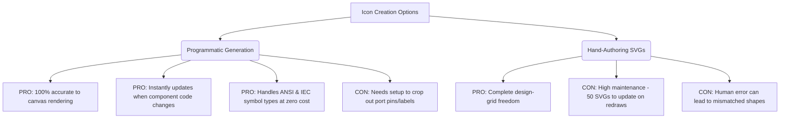

# GGate Icon Creation and Asset Management Plan

This document outlines the strategy for clean, scalable, and standardized icon management in GGate (GTK4 + libadwaita). It addresses existing asset path issues, missing icons, and provides a programmatic workflow for generating component icons directly from the canvas rendering code.

---

## 1. Executive Summary & Core Recommendation

GGate currently suffers from a split asset-delivery model:
1. **Direct Filesystem Lookups:** The side palette ([ComponentView.py](file:///Users/ekureedem/Documents/Projects/GGate/ggate/ComponentView.py)) and context menus ([MenuPopover.py](file:///Users/ekureedem/Documents/Projects/GGate/ggate/MenuPopover.py)) resolve absolute paths relative to local directories, which breaks both inside Python virtual environments and installed system prefixes (e.g., `/usr/lib/python3/...`).
2. **Non-Standard GResource Structure:** The resource compiler config in [dev-resources.xml](file:///Users/ekureedem/Documents/Projects/GGate/data/images/dev-resources.xml) bundles icons under a non-standard hierarchy (`/data/icons/scalable/actions/`), misfiling components under actions and bypassing GTK's native `Gtk.IconTheme` matching engine.
3. **PNG/SVG Mixture & Missing Assets:** Component icons are a mix of PNGs and SVGs. Important toolbar assets (like the specific net connector drawing icon) are missing, forcing fallback placeholders.

### Recommendation: Programmatic Cairo SVG Generation + GResource Theme Mapping
* **For Logic Gates:** Rather than manually drawing 25+ logic gate SVGs twice (for ANSI and IEC styles), we will write a dev-time script (`bin/generate-gate-icons.py`) that instantiates each gate component, evaluates its bounding box, mocks a Cairo `cairo.SVGSurface`, and invokes `drawComponent`. This ensures **100% accuracy**, zero maintenance overhead, and instant updates when canvas drawing code changes.
* **For Infrastructure:** Restructure the resource compile targets using GResource `alias` attributes to conform to the Freedesktop directory spec (`hicolor/scalable/actions` and `hicolor/scalable/devices`). Register the resource base with `Gtk.IconTheme` at startup, and switch all references to standard icon-name lookups (`Gtk.Image.new_from_icon_name`).

---

## 2. Complete Icon Inventory

### A. Logic Gate & Component Palette Icons
These represent the placeable circuit elements loaded in the side palette. Currently, they reside in `data/images/components/`.

| Component Key | Component Name | Current State | Target Format | Generation Style / Notes |
|---|---|---|---|---|
| `definitions.component_NOT` | `not` | PNG only (`not.png`) | SVG (Symbolic) | Programmatic (ANSI & IEC) |
| `definitions.component_AND` | `and` | PNG & SVG | SVG (Symbolic) | Programmatic (ANSI & IEC) |
| `definitions.component_OR` | `or` | PNG & SVG | SVG (Symbolic) | Programmatic (ANSI & IEC) |
| `definitions.component_XOR` | `xor` | PNG only | SVG (Symbolic) | Programmatic (ANSI & IEC) |
| `definitions.component_NAND` | `nand` | SVG only | SVG (Symbolic) | Programmatic (ANSI & IEC) |
| `definitions.component_NOR` | `nor` | SVG only | SVG (Symbolic) | Programmatic (ANSI & IEC) |
| `definitions.component_tribuff` | `tribuff` | PNG only | SVG (Symbolic) | Programmatic (ANSI & IEC) |
| `definitions.component_SW` | `sw` | PNG only | SVG (Symbolic) | Programmatic (ANSI & IEC) |
| `definitions.component_7seg` | `7seg` | SVG only | SVG (Symbolic) | Programmatic (ANSI & IEC) |
| `definitions.component_LED` | `led` | PNG only | SVG (Symbolic) | Programmatic (ANSI & IEC) |
| `definitions.component_VDD` | `vdd` | PNG only | SVG (Symbolic) | Programmatic (ANSI & IEC) |
| `definitions.component_GND` | `gnd` | SVG only | SVG (Symbolic) | Programmatic (ANSI & IEC) |
| `definitions.component_OSC` | `osc` | PNG only | SVG (Symbolic) | Programmatic (ANSI & IEC) |
| `definitions.component_probe` | `probe` | PNG only | SVG (Symbolic) | Programmatic (ANSI & IEC) |
| `definitions.component_text` | `text` | PNG & SVG | SVG (Symbolic) | Programmatic (ANSI & IEC) |
| `definitions.component_RSFF` | `rsff` | SVG only | SVG (Symbolic) | Programmatic (ANSI & IEC) |
| `definitions.component_JKFF` | `jkff` | SVG only | SVG (Symbolic) | Programmatic (ANSI & IEC) |
| `definitions.component_DFF` | `dff` | SVG only | SVG (Symbolic) | Programmatic (ANSI & IEC) |
| `definitions.component_TFF` | `tff` | SVG only | SVG (Symbolic) | Programmatic (ANSI & IEC) |
| `definitions.component_counter` | `counter` | SVG only | SVG (Symbolic) | Programmatic (ANSI & IEC) |
| `definitions.component_adder` | `adder` | SVG only | SVG (Symbolic) | Programmatic (ANSI & IEC) |
| `definitions.component_SISO` | `siso` | SVG only | SVG (Symbolic) | Programmatic (ANSI & IEC) |
| `definitions.component_SIPO` | `sipo` | SVG only | SVG (Symbolic) | Programmatic (ANSI & IEC) |
| `definitions.component_PISO` | `piso` | SVG only | SVG (Symbolic) | Programmatic (ANSI & IEC) |
| `definitions.component_PIPO` | `pipo` | SVG only | SVG (Symbolic) | Programmatic (ANSI & IEC) |

### B. Toolbar & Action Icons
These are used for editor manipulation and toolbar commands in [MainFrame.py](file:///Users/ekureedem/Documents/Projects/GGate/ggate/MainFrame.py).

| Icon Role | Reference Name | Source Type | Current State | Target State / Fix |
|---|---|---|---|---|
| **Rotate Left** | `rotate-left-symbolic` | Custom SVG | SVG (`actions/rotate-left.svg`) | Modernized 16x16 viewbox symbolic |
| **Rotate Right** | `rotate-right-symbolic` | Custom SVG | SVG (`actions/rotate-right.svg`) | Modernized 16x16 viewbox symbolic |
| **Flip Horizontally** | `flip-horizontal-symbolic` | Custom SVG | SVG (`actions/flip-horizontal.svg`) | Modernized 16x16 viewbox symbolic |
| **Flip Vertically** | `flip-vertical-symbolic` | Custom SVG | SVG (`actions/flip-vertical.svg`) | Modernized 16x16 viewbox symbolic |
| **Add Net** | `add-net-symbolic` | Custom SVG | **Missing** (uses fallback `list-add`) | Create custom SVG showing wire symbol |
| **Simulation Start** | `media-playback-start-symbolic` | System | Standard theme icon | Keep standard Freedesktop icon |
| **Simulation Pause** | `media-playback-pause-symbolic` | System | Standard theme icon | Keep standard Freedesktop icon |
| **Simulation Stop** | `media-playback-stop-symbolic` | System | Standard theme icon | Keep standard Freedesktop icon |
| **Open Menu** | `open-menu-symbolic` | System | Standard theme icon | Keep standard Freedesktop icon |

### C. Application & Document Icons
Standard system integration assets.

| Icon Role | Target Name | Size Directory | Current State | Target State |
|---|---|---|---|---|
| **App Launcher Icon** | `org.astralco.GGate.svg` | `scalable/apps` | SVG (`scalable/ggate.svg`) | Scalable SVG (high-res compliant) |
| **App Launcher Icon** | `org.astralco.GGate.png` | `apps/[size]x[size]` | PNGs (`apps/[size]/ggate.png`) | Regenerated from scalable target |
| **GGate Document Icon** | `application-x-ggate-circuit-symbolic.svg` | `scalable/mimetypes` | **Missing** (only PNGs exist) | Scalable SVG representing circuit file |
| **GGate Document Icon** | `application-x-ggate-circuit.png` | `mimetypes/[size]x[size]` | PNGs (`mime/[size]/text-glc.png`) | Rename & regenerate to match MIME spec |

### D. Per-Component Visual Specifications

This subsection provides the ground-truth visual specs derived directly from each component's canvas drawing implementation (`drawComponent`, `drawComponentEditOverlap`, etc.).

#### 1. `not` (NOT Gate)
* **Source File:** [NOT.py](file:///Users/ekureedem/Documents/Projects/GGate/ggate/Components/LogicGates/Standard/NOT.py)
* **Bounding Box (`comp_rect`):** `[10, -40, 90, 0]`
* **Body Silhouette:**
  * **ANSI (distinctive):** Right-pointing triangle with vertices `(30, -35)`, `(30, -5)`, and `(60, -20)`.
  * **IEC (rectangular):** Rectangle starting at `(30, -40)` with width `30` and height `40`.
* **Distinguishing Marks:**
  * **Both styles:** Inversion bubble (circle) centered at `(66, -20)` with radius `6` (extending `x` from `60` to `72`).
  * **IEC Only:** Centered internal text `"1"` at `(45, -40)` (align: `0.5`, `0.0`).
* **Terminals & Pins:**
  * **Input:** 1 pin at `(10, -20)`. Stub: `(10, -20)` to `(30, -20)`.
  * **Output:** 1 pin at `(90, -20)`. Stub: `(72, -20)` to `(90, -20)` (connecting to the edge of the inversion bubble).
* **Smart Crop (Body only):** `[30, -40, 72, 0]`

#### 2. `and` (AND Gate)
* **Source File:** [AND.py](file:///Users/ekureedem/Documents/Projects/GGate/ggate/Components/LogicGates/Standard/AND.py)
* **Bounding Box (`comp_rect`):** `[10, -40, 100, 0]`
* **Body Silhouette:**
  * **ANSI (distinctive):** D-shape. Flat back segment from `(30, -40)` to `(30, 0)`. Parallel top/bottom lines extending to `(60, -40)` and `(60, 0)`. Front semi-circle centered at `(60, -20)` with radius `20`.
  * **IEC (rectangular):** Rectangle starting at `(30, -40)` with width `50` and height `40`.
* **Distinguishing Marks:**
  * **IEC Only:** Centered internal text `"&"` at `(55, -40)` (align: `0.5`, `0.0`).
* **Terminals & Pins:**
  * **Inputs (2 or 3):**
    * 2-pin: `(10, -30)` and `(10, -10)`. Stubs: `(10, -30)` to `(30, -30)`, `(10, -10)` to `(30, -10)`.
    * 3-pin: Adds `(10, -20)`. Stub: `(10, -20)` to `(30, -20)`.
  * **Output:** 1 pin at `(100, -20)`. Stub: `(80, -20)` to `(100, -20)`.
* **Smart Crop (Body only):** `[30, -40, 80, 0]`

#### 3. `or` (OR Gate)
* **Source File:** [OR.py](file:///Users/ekureedem/Documents/Projects/GGate/ggate/Components/LogicGates/Standard/OR.py)
* **Bounding Box (`comp_rect`):** `[10, -40, 100, 0]`
* **Body Silhouette:**
  * **ANSI (distinctive):** Shield-like shape pointing right.
    - Curved back edge: Bezier curve from `(30, -40)` to `(30, 0)` with control points `(40, -30)` and `(40, -10)`.
    - Curved top edge: Bezier from `(30, -40)` to tip `(80, -20)` with control points `(50, -40)` and `(65, -40)`.
    - Curved bottom edge: Bezier from `(30, 0)` to tip `(80, -20)` with control points `(50, 0)` and `(65, 0)`.
  * **IEC (rectangular):** Rectangle starting at `(30, -40)` with width `50` and height `40`.
* **Distinguishing Marks:**
  * **IEC Only:** Centered internal text `"≥1"` at `(55, -40)` (align: `0.5`, `0.0`).
* **Terminals & Pins:**
  * **Inputs (2 or 3):**
    * 2-pin: `(10, -30)` and `(10, -10)`. Stubs: ANSI to `(36, -30)` / `(36, -10)`, IEC to `(30, -30)` / `(30, -10)`.
    * 3-pin: Adds `(10, -20)`. Stubs: ANSI to `(36, -30)` / `(37, -20)` / `(36, -10)`, IEC to `(30, y)`.
  * **Output:** 1 pin at `(100, -20)`. Stub: `(80, -20)` to `(100, -20)`.
* **Smart Crop (Body only):** `[30, -40, 80, 0]`

#### 4. `xor` (XOR Gate)
* **Source File:** [XOR.py](file:///Users/ekureedem/Documents/Projects/GGate/ggate/Components/LogicGates/Standard/XOR.py)
* **Bounding Box (`comp_rect`):** `[10, -40, 100, 0]`
* **Body Silhouette:**
  * **ANSI (distinctive):** Same shield shape as OR, plus an extra curved line offset at the input back: Bezier from `(25, -40)` to `(25, 0)` with control points `(35, -30)` and `(35, -10)`.
  * **IEC (rectangular):** Rectangle starting at `(30, -40)` with width `50` and height `40`.
* **Distinguishing Marks:**
  * **ANSI Only:** Extra curved input back line.
  * **IEC Only:** Centered internal text `"=1"` at `(55, -40)` (align: `0.5`, `0.0`).
* **Terminals & Pins:**
  * **Inputs (2 or 3):** Same connections/stubs as OR.
  * **Output:** 1 pin at `(100, -20)`. Stub: `(80, -20)` to `(100, -20)`.
* **Smart Crop (Body only):** `[25, -40, 80, 0]`

#### 5. `nand` (NAND Gate)
* **Source File:** [NAND.py](file:///Users/ekureedem/Documents/Projects/GGate/ggate/Components/LogicGates/Standard/NAND.py)
* **Bounding Box (`comp_rect`):** `[10, -40, 110, 0]`
* **Body Silhouette:**
  * **ANSI (distinctive):** Same D-shape as AND.
  * **IEC (rectangular):** Rectangle starting at `(30, -40)` with width `50` and height `40`.
* **Distinguishing Marks:**
  * **ANSI Only:** Inversion bubble (circle) at `(86, -20)` with radius `6` (extends `x` from `80` to `92`).
  * **IEC Only:** Centered internal text `"&"` at `(55, -40)` (align: `0.5`, `0.0`) and output diagonal inversion stroke from `(80, -28)` to `(92, -20)`.
* **Terminals & Pins:**
  * **Inputs (2 or 3):** Same as AND.
  * **Output:** 1 pin at `(110, -20)`. Stub: `(92, -20)` to `(110, -20)`.
* **Smart Crop (Body only):** `[30, -40, 92, 0]`

#### 6. `nor` (NOR Gate)
* **Source File:** [NOR.py](file:///Users/ekureedem/Documents/Projects/GGate/ggate/Components/LogicGates/Standard/NOR.py)
* **Bounding Box (`comp_rect`):** `[10, -40, 110, 0]`
* **Body Silhouette:**
  * **ANSI (distinctive):** Same shield shape as OR.
  * **IEC (rectangular):** Rectangle starting at `(30, -40)` with width `50` and height `40`.
* **Distinguishing Marks:**
  * **ANSI Only:** Inversion bubble (circle) at `(86, -20)` with radius `6` (extends `x` from `80` to `92`).
  * **IEC Only:** Centered internal text `"≥1"` at `(55, -40)` (align: `0.5`, `0.0`) and output diagonal inversion stroke from `(80, -28)` to `(92, -20)`.
* **Terminals & Pins:**
  * **Inputs (2 or 3):** Same as OR.
  * **Output:** 1 pin at `(110, -20)`. Stub: `(92, -20)` to `(110, -20)`.
* **Smart Crop (Body only):** `[30, -40, 92, 0]`

#### 7. `tribuff` (Tri-State Buffer)
* **Source File:** [TSB.py](file:///Users/ekureedem/Documents/Projects/GGate/ggate/Components/LogicGates/Standard/TSB.py)
* **Bounding Box (`comp_rect`):** `[10, -40, 90, 0]` (*Note: Control pin stub vertically extends to `y = -60`*).
* **Body Silhouette:**
  * **ANSI / All styles:** Right-pointing triangle with vertices `(30, -35)`, `(30, -5)`, and `(60, -20)`.
  * *Note: The code does not define a separate IEC variant (the triangle is drawn only when `Preference.symbol_type == 0`)*.
* **Distinguishing Marks:**
  * **Active Low Control:** Circle (control bubble) at `(40, -35)` with radius `4` (if triggered on low level).
  * **Inversion Output:** Circle (bubble) at `(64, -20)` with radius `4` (if inverted output).
* **Terminals & Pins:**
  * **Data Input:** 1 pin at `(10, -20)`. Stub: `(10, -20)` to `(30, -20)`.
  * **Control (Enable):** 1 pin at `(40, -60)`. Stub: `(40, -60)` to `(40, -38)` (active low) or `(40, -30)` (active high).
  * **Output:** 1 pin at `(80, -20)`. Stub: `(68, -20)` to `(80, -20)` (inverted) or `(58, -20)` to `(80, -20)` (non-inverted).
* **Smart Crop (Body only):** `[30, -40, 68, 0]`

#### 8. `sw` (Switch)
* **Source File:** [SW.py](file:///Users/ekureedem/Documents/Projects/GGate/ggate/Components/LogicGates/Standard/SW.py)
* **Bounding Box (`comp_rect`):** `[10, -40, 70, 0]`
* **Body Silhouette:**
  * Rectangle starting at `(10, -40)` with width `40` and height `40`.
* **Distinguishing Marks:**
  * Horizontal inner track rectangle: `(15, -30)` with width `30` and height `10`.
  * Centered internal text labels: `"L"` at `(20, -10)` and `"H"` at `(40, -10)` (align: `0.5`, `0.5`).
  * Slide handle: Outlined rectangle at `(17, -28)` of size `12x6` (Edit mode / Low state) or filled rectangle at `(30.5, -28.5)` of size `13x7` (High state in Run mode).
* **Terminals & Pins:**
  * **Output:** 1 pin at `(70, -20)`. Stub: `(50, -20)` to `(70, -20)`.
  * **Inputs:** None.
* **Smart Crop (Body only):** `[10, -40, 50, 0]`

#### 9. `7seg` (Seven-Segment Display)
* **Source File:** [SevenSegment.py](file:///Users/ekureedem/Documents/Projects/GGate/ggate/Components/LogicGates/StateViewers/SevenSegment.py)
* **Bounding Box (`comp_rect`):** `[10, -80, 100, 0]`
* **Body Silhouette:**
  * Rectangle starting at `(30, -80)` with width `70` and height `80`.
* **Distinguishing Marks:**
  * Centered 7-segment display layout, with segments drawn as polygons:
    - **a (top):** `(60, -70), (62, -68), (88, -68), (90, -70), (88, -72), (62, -72)`
    - **b (top-right):** `(90, -70), (88, -68), (88, -42), (90, -40), (92, -42), (92, -68)`
    - **c (bottom-right):** `(90, -40), (88, -38), (88, -12), (90, -10), (92, -12), (92, -38)`
    - **d (bottom):** `(60, -10), (62, -8), (88, -8), (90, -10), (88, -12), (62, -12)`
    - **e (bottom-left):** `(60, -40), (58, -38), (58, -12), (60, -10), (62, -12), (62, -38)`
    - **f (top-left):** `(60, -70), (58, -68), (58, -42), (60, -40), (62, -42), (62, -68)`
    - **g (middle):** `(60, -40), (62, -38), (88, -38), (90, -40), (88, -42), (62, -42)`
  - Centered internal labels on left: `"IA"`, `"IB"`, `"IC"`, and `"ID"` at `(35, -70)`, `(35, -50)`, `(35, -30)`, and `(35, -10)` (align: `0.0`, `0.5`).
* **Terminals & Pins:**
  - **Inputs:** 4 pins at `(10, -70)`, `(10, -50)`, `(10, -30)`, and `(10, -10)`. Stubs go from `(10, y)` to `(30, y)`.
  - **Outputs:** None.
* **Smart Crop (Body only):** `[30, -80, 100, 0]`

#### 10. `led` (LED Display)
* **Source File:** [LED.py](file:///Users/ekureedem/Documents/Projects/GGate/ggate/Components/LogicGates/StateViewers/LED.py)
* **Bounding Box (`comp_rect`):** `[10, -40, 70, 0]`
* **Body Silhouette:**
  * Rectangle starting at `(30, -40)` with width `40` and height `40`.
* **Distinguishing Marks:**
  * Centered inner circular LED element at `(50, -20)` with radius `8`.
* **Terminals & Pins:**
  - **Input:** 1 pin at `(10, -20)`. Stub goes from `(10, -20)` to `(30, -20)`.
  - **Outputs:** None.
* **Smart Crop (Body only):** `[30, -40, 70, 0]`

#### 11. `vdd` (VDD Rail)
* **Source File:** [VDD.py](file:///Users/ekureedem/Documents/Projects/GGate/ggate/Components/LogicGates/Standard/VDD.py)
* **Bounding Box (`comp_rect`):** `[10, -40, 30, 0]`
* **Body Silhouette:**
  * Horizontal bar: `(10, -20)` to `(30, -20)`.
  * Tiny square dot at `(19, -21)` of size 2x2.
* **Distinguishing Marks:**
  * Centered text label `"Vdd"` drawn above the bar at `(20, -30)` (align: `0.5`, `0.5`).
* **Terminals & Pins:**
  - **Output:** 1 pin at `(20, 0)`. Stub drawn vertically from `(20, -20)` to `(20, 0)`.
  - **Inputs:** None.
* **Smart Crop (Body only):** `[10, -40, 30, -20]`

#### 12. `gnd` (GND Rail)
* **Source File:** [GND.py](file:///Users/ekureedem/Documents/Projects/GGate/ggate/Components/LogicGates/Standard/GND.py)
* **Bounding Box (`comp_rect`):** `[10, -50, 30, 0]`
* **Body Silhouette:**
  * Horizontal bar: `(10, -30)` to `(30, -30)`.
* **Distinguishing Marks:**
  * Three parallel diagonal ground stripes extending down-left:
    - Stripe 1: `(16, -30)` to `(12, -20)`
    - Stripe 2: `(22, -30)` to `(18, -20)`
    - Stripe 3: `(28, -30)` to `(24, -20)`
  * Centered text label `"GND"` drawn below stripes at `(20, -10)` (align: `0.5`, `0.5`).
* **Terminals & Pins:**
  - **Output:** 1 pin at `(20, -50)`. Stub drawn vertically from `(20, -50)` to `(20, -30)`.
  - **Inputs:** None.
* **Smart Crop (Body only):** `[10, -30, 30, 0]`

#### 13. `osc` (Oscillator)
* **Source File:** [OSC.py](file:///Users/ekureedem/Documents/Projects/GGate/ggate/Components/LogicGates/Standard/OSC.py)
* **Bounding Box (`comp_rect`):** `[10, -40, 70, 0]`
* **Body Silhouette:**
  * Rectangle starting at `(10, -40)` with width `40` and height `40`.
* **Distinguishing Marks:**
  * Inner square-wave glyph drawn at `y = -10` and `y = -30` levels:
    - Path: `(15, -10) -> (20, -10) -> (20, -30) -> (25, -30) -> (25, -10) -> (30, -10) -> (30, -30) -> (35, -30) -> (35, -10) -> (40, -10) -> (40, -30) -> (45, -30)`.
* **Terminals & Pins:**
  - **Output:** 1 pin at `(70, -20)`. Stub goes from `(50, -20)` to `(70, -20)`.
  - **Inputs:** None.
* **Smart Crop (Body only):** `[10, -40, 50, 0]`

#### 14. `probe` (Probe)
* **Source File:** [Probe.py](file:///Users/ekureedem/Documents/Projects/GGate/ggate/Components/LogicGates/Miscellaneous/Probe.py)
* **Bounding Box (`comp_rect`):** Dynamic: `[10, -20, 55 + label_width, 0]`. `label_width` defaults to minimum 12.
* **Body Silhouette:**
  * Circle centered at `(40, -10)` with radius `10`.
* **Distinguishing Marks:**
  * Centered internal text label `"V"` at `(40, -10)` (align: `0.5`, `0.5`).
  * External text label: drawn starting at `(55, -10)` containing name string (align: `0.0`, `0.5`).
* **Terminals & Pins:**
  - **Input:** 1 pin at `(10, -10)`. Stub goes from `(10, -10)` to `(30, -10)`.
  - **Outputs:** None.
* **Smart Crop (Body only):** `[30, -20, 50, 0]`

#### 15. `text` (Text Box)
* **Source File:** [Text.py](file:///Users/ekureedem/Documents/Projects/GGate/ggate/Components/LogicGates/Miscellaneous/Text.py)
* **Bounding Box (`comp_rect`):** Dynamic: `[10, -10 - height/2, 10 + width, -10 + height/2]`, minimum size 12x12.
* **Body Silhouette:** None (no body outline is drawn).
* **Distinguishing Marks:**
  * User-specified text drawn starting at `(10, -10)` (align: `0.0`, `0.5`).
* **Terminals & Pins:** None.
* **Smart Crop (Body only):** Matches dynamic bounding box.

#### 16. `rsff` (RS Flip-Flop)
* **Source File:** [RSFF.py](file:///Users/ekureedem/Documents/Projects/GGate/ggate/Components/LogicGates/FlipFlops/RSFF.py)
* **Bounding Box (`comp_rect`):** `[10, -40, 100, 0]`
* **Body Silhouette:**
  * Rectangle starting at `(30, -40)` with width `50` and height `40`.
* **Distinguishing Marks:**
  * Centered internal text labels:
    - `"S"` at `(35, -30)` (align: `0.0`, `0.5`).
    - `"R"` at `(35, -10)` (align: `0.0`, `0.5`).
    - `"Q"` at `(75, -30)` (align: `1.0`, `0.5`).
    - `"~Q"` at `(75, -10)` (align: `1.0`, `0.5`).
* **Terminals & Pins:**
  - **Inputs:** 2 pins: `(10, -30)` (`S`) and `(10, -10)` (`R`). Stubs go from `(10, y)` to `(30, y)`.
  - **Outputs:** 2 pins: `(100, -30)` (`Q`) and `(100, -10)` (`~Q`). Stubs go from `(80, y)` to `(100, y)`.
* **Smart Crop (Body only):** `[30, -40, 80, 0]`

#### 17. `jkff` (JK Flip-Flop)
* **Source File:** [JKFF.py](file:///Users/ekureedem/Documents/Projects/GGate/ggate/Components/LogicGates/FlipFlops/JKFF.py)
* **Bounding Box (`comp_rect`):** `[10, -60, 110, 0]`
* **Body Silhouette:**
  * Rectangle starting at `(30, -60)` with width `60` and height `60`.
* **Distinguishing Marks:**
  * Negative-edge trigger clock bubble: Circle centered at `(25, -30)` with radius `5` (if negative-edge triggered).
  * Clock-edge triangle: Inward-pointing triangle at clock input `(30, -35), (40, -30), (30, -25)`.
  * Centered internal text labels:
    - `"J"` at `(45, -50)` (align: `0.0`, `0.5`).
    - `"CK"` at `(45, -30)` (align: `0.0`, `0.5`).
    - `"K"` at `(45, -10)` (align: `0.0`, `0.5`).
    - `"Q"` at `(85, -50)` (align: `1.0`, `0.5`).
    - `"~Q"` at `(85, -10)` (align: `1.0`, `0.5`).
* **Terminals & Pins:**
  - **Inputs:** 3 pins: `(10, -50)` (`J`), `(10, -30)` (`CK`), and `(10, -10)` (`K`). Stubs for `J` and `K` go to `(30, y)`. `CK` stub goes to `(30, -30)` (positive edge) or `(20, -30)` (negative edge).
  - **Outputs:** 2 pins: `(110, -50)` (`Q`), `(110, -10)` (`~Q`). Stubs go from `(90, y)` to `(110, y)`.
* **Smart Crop (Body only):** `[30, -60, 90, 0]`

#### 18. `dff` (D Flip-Flop)
* **Source File:** [DFF.py](file:///Users/ekureedem/Documents/Projects/GGate/ggate/Components/LogicGates/FlipFlops/DFF.py)
* **Bounding Box (`comp_rect`):** `[10, -40, 110, 0]`
* **Body Silhouette:**
  * Rectangle starting at `(30, -40)` with width `60` and height `40`.
* **Distinguishing Marks:**
  * Negative-edge trigger clock bubble: Circle centered at `(25, -10)` with radius `5` (if negative-edge triggered).
  * Clock-edge triangle: Inward-pointing triangle at clock input `(30, -15), (40, -10), (30, -5)`.
  * Centered internal text labels:
    - `"D"` at `(45, -30)` (align: `0.0`, `0.5`).
    - `"CK"` at `(45, -10)` (align: `0.0`, `0.5`).
    - `"Q"` at `(85, -30)` (align: `1.0`, `0.5`).
    - `"~Q"` at `(85, -10)` (align: `1.0`, `0.5`).
* **Terminals & Pins:**
  - **Inputs:** 2 pins: `(10, -30)` (`D`) and `(10, -10)` (`CK`). Stub for `D` goes to `(30, -30)`. `CK` stub goes to `(30, -10)` (positive edge) or `(20, -10)` (negative edge).
  - **Outputs:** 2 pins: `(110, -30)` (`Q`), `(110, -10)` (`~Q`). Stubs go from `(90, y)` to `(110, y)`.
* **Smart Crop (Body only):** `[30, -40, 90, 0]`

#### 19. `tff` (T Flip-Flop)
* **Source File:** [TFF.py](file:///Users/ekureedem/Documents/Projects/GGate/ggate/Components/LogicGates/FlipFlops/TFF.py)
* **Bounding Box (`comp_rect`):** `[10, -40, 110, 0]`
* **Body Silhouette:**
  * Rectangle starting at `(30, -40)` with width `60` and height `40`.
* **Distinguishing Marks:**
  * Negative-edge trigger clock bubble: Circle centered at `(25, -20)` with radius `5` (if negative-edge triggered).
  * Clock-edge triangle: Inward-pointing triangle at clock input `(30, -25), (40, -20), (30, -15)`.
  * Centered internal text labels:
    - `"T"` at `(45, -20)` (align: `0.0`, `0.5`).
    - `"Q"` at `(85, -30)` (align: `1.0`, `0.5`).
    - `"~Q"` at `(85, -10)` (align: `1.0`, `0.5`).
* **Terminals & Pins:**
  - **Input:** 1 pin at `(10, -20)` (`T`). Stub goes to `(30, -20)` (positive edge) or `(20, -20)` (negative edge).
  - **Outputs:** 2 pins: `(110, -30)` (`Q`), `(110, -10)` (`~Q`). Stubs go from `(90, y)` to `(110, y)`.
* **Smart Crop (Body only):** `[30, -40, 90, 0]`

#### 20. `counter` (Mod-N Counter)
* **Source File:** [ModNCounter.py](file:///Users/ekureedem/Documents/Projects/GGate/ggate/Components/LogicGates/Counters/ModNCounter.py)
* **Bounding Box (`comp_rect`):** Dynamic based on bits: `[10, min((outpin_t - 10, -60)), 120, max((outpin_b + 10, -20))]` (default 4 bits: `[10, -80, 120, 0]`).
* **Body Silhouette:**
  * Rectangle starting at `(30, comp_rect[1])` with width `70` and height `comp_rect[3] - comp_rect[1]` (width 70, height 80 for default 4 bits).
* **Distinguishing Marks:**
  * Negative-edge trigger clock bubble: Circle centered at `(25, -50)` with radius `5` (if negative-edge triggered).
  * Clock-edge triangle: Inward-pointing triangle at clock input `(30, -55), (40, -50), (30, -45)`.
  * Centered internal text labels:
    - `"CK"` at `(45, -50)` (align: `0.0`, `0.5`).
    - `"RST"` at `(45, -30)` (align: `0.0`, `0.5`).
    - `"Q0"`, `"Q1"`, ... at `(95, y)` (align: `1.0`, `0.5`) for each output pin.
* **Terminals & Pins:**
  - **Inputs:** 2 pins: `(10, -50)` (`CK`), `(10, -30)` (`RST`). `RST` stub goes to `(30, -30)`. `CK` stub goes to `(30, -50)` (positive edge) or `(20, -50)` (negative edge).
  - **Outputs:** `bits` output pins: `(120, y)` for `y` in range `outpin_t` to `outpin_b` with step 20 (e.g. `[-70, -50, -30, -10]` for default 4 bits). Stubs go from `(100, y)` to `(120, y)`.
* **Smart Crop (Body only):** `[30, comp_rect[1], 100, comp_rect[3]]`

#### 21. `adder` (Adder)
* **Source File:** [Calculator.py](file:///Users/ekureedem/Documents/Projects/GGate/ggate/Components/LogicGates/Calculator.py)
* **Bounding Box (`comp_rect`):** `[10, -40, 100, 0]` (Half Adder) or `[10, -60, 100, 0]` (Full Adder).
* **Body Silhouette:**
  * Rectangle starting at `(30, -40)` with size 50x40 (Half) or starting at `(30, -60)` with size 50x60 (Full).
* **Distinguishing Marks:**
  * Centered internal text labels:
    - **Half Adder:** `"X"` at `(35, -30)`, `"Y"` at `(35, -10)`, `"C"` at `(75, -30)`, `"S"` at `(75, -10)`.
    - **Full Adder:** `"X"` at `(35, -50)`, `"Y"` at `(35, -30)`, `"Z"` at `(35, -10)`, `"C"` at `(75, -50)`, `"S"` at `(75, -10)`.
* **Terminals & Pins:**
  - **Inputs:**
    - Half Adder (2 pins): `(10, -30)` (`X`), `(10, -10)` (`Y`). Stubs to `(30, y)`.
    - Full Adder (3 pins): `(10, -50)` (`X`), `(10, -30)` (`Y`), `(10, -10)` (`Z`). Stubs to `(30, y)`.
  - **Outputs:** 2 pins:
    - Half Adder: `(100, -30)` (`C`), `(100, -10)` (`S`). Stubs from `(80, y)` to `(100, y)`.
    - Full Adder: `(100, -50)` (`C`), `(100, -10)` (`S`). Stubs from `(80, y)` to `(100, y)`.
* **Smart Crop (Body only):** `[30, comp_rect[1], 80, 0]`

#### 22. `siso` (SISO Shift Register)
* **Source File:** [SISOShiftRegister.py](file:///Users/ekureedem/Documents/Projects/GGate/ggate/Components/LogicGates/Counters/SISOShiftRegister.py)
* **Bounding Box (`comp_rect`):** `[10, -60, 120, 0]`
* **Body Silhouette:**
  * Rectangle starting at `(30, -60)` with width `70` and height `60`.
* **Distinguishing Marks:**
  * Negative-edge trigger clock bubble: Circle centered at `(25, -10)` with radius `5` (if negative-edge triggered).
  * Clock-edge triangle: Inward-pointing triangle at clock input `(30, -15), (40, -10), (30, -5)`.
  * Centered internal text labels:
    - `"SISO"` at `(65, -50)` (align: `0.5`, `0.5`).
    - `"D"` at `(45, -30)` (align: `0.0`, `0.5`).
    - `"CK"` at `(45, -10)` (align: `0.0`, `0.5`).
    - `"Q"` at `(95, -30)` (align: `1.0`, `0.5`).
    - `"~Q"` at `(95, -10)` (align: `1.0`, `0.5`).
* **Terminals & Pins:**
  - **Inputs:** 2 pins: `(10, -30)` (`D`), `(10, -10)` (`CK`). `D` stub goes to `(30, -30)`. `CK` stub goes to `(30, -10)` (positive edge) or `(20, -10)` (negative edge).
  - **Outputs:** 2 pins: `(120, -30)` (`Q`), `(120, -10)` (`~Q`). Stubs go from `(100, y)` to `(120, y)`.
* **Smart Crop (Body only):** `[30, -60, 100, 0]`

#### 23. `sipo` (SIPO Shift Register)
* **Source File:** [SIPOShiftRegister.py](file:///Users/ekureedem/Documents/Projects/GGate/ggate/Components/LogicGates/Counters/SIPOShiftRegister.py)
* **Bounding Box (`comp_rect`):** Dynamic based on bits: `[10, min((outpin_t - 30, -90)), 120, max((outpin_b + 10, -10))]` (default 4 bits: `[10, -100, 120, 0]`).
* **Body Silhouette:**
  * Rectangle starting at `(30, comp_rect[1])` with width `70` and height `comp_rect[3] - comp_rect[1]` (width 70, height 100 for default 4 bits).
* **Distinguishing Marks:**
  * Negative-edge trigger clock bubble: Circle centered at `(25, -40)` with radius `5` (if negative-edge triggered).
  * Clock-edge triangle: Inward-pointing triangle at clock input `(30, -45), (40, -40), (30, -35)`.
  * Centered internal text labels:
    - `"SIPO"` at `(65, comp_rect[1] + 10)` (align: `0.5`, `0.5`).
    - `"D"` at `(45, -60)` (align: `0.0`, `0.5`).
    - `"CK"` at `(45, -40)` (align: `0.0`, `0.5`).
    - `"RST"` at `(45, -20)` (align: `0.0`, `0.5`).
    - `"Q0"`, `"Q1"`, ... at `(95, y)` (align: `1.0`, `0.5`) for each output pin.
* **Terminals & Pins:**
  - **Inputs:** 3 pins: `(10, -60)` (`D`), `(10, -40)` (`CK`), and `(10, -20)` (`RST`). `D` and `RST` stubs go to `(30, y)`. `CK` stub goes to `(30, -40)` (positive edge) or `(20, -40)` (negative edge).
  - **Outputs:** `bits` output pins: `(120, y)` for `y` in range `outpin_t` to `outpin_b` with step 20 (e.g. `[-70, -50, -30, -10]` for default 4 bits). Stubs go from `(100, y)` to `(120, y)`.
* **Smart Crop (Body only):** `[30, comp_rect[1], 100, comp_rect[3]]`

#### 24. `piso` (PISO Shift Register)
* **Source File:** [PISOShiftRegister.py](file:///Users/ekureedem/Documents/Projects/GGate/ggate/Components/LogicGates/Counters/PISOShiftRegister.py)
* **Bounding Box (`comp_rect`):** Dynamic based on bits: `[10, min((inpin_t - 50, -90)), 120, max((inpin_b + 30, -30))]` (default 4 bits: `[10, -140, 120, 0]`).
* **Body Silhouette:**
  * Rectangle starting at `(30, comp_rect[1])` with width `70` and height `comp_rect[3] - comp_rect[1]` (width 70, height 140 for default 4 bits).
* **Distinguishing Marks:**
  * Negative-edge trigger clock bubble: Circle centered at `(25, inpin_b + 20)` with radius `5` (if negative-edge triggered).
  * Clock-edge triangle: Inward-pointing triangle at clock input `(30, inpin_b + 15), (40, inpin_b + 20), (30, inpin_b + 25)`.
  * Centered internal text labels:
    - `"PISO"` at `(65, comp_rect[1] + 10)` (align: `0.5`, `0.5`).
    - `"W/S"` at `(45, inpin_t - 20)` (align: `0.0`, `0.5`).
    - `"D0"`, `"D1"`, ... at `(45, y)` (align: `0.0`, `0.5`) for each data input pin.
    - `"CK"` at `(45, inpin_b + 20)` (align: `0.0`, `0.5`).
    - `"Q"` at `(95, -70)` (align: `1.0`, `0.5`).
    - `"~Q"` at `(95, -50)` (align: `1.0`, `0.5`).
* **Terminals & Pins:**
  - **Inputs:** `bits + 2` pins: `(10, inpin_t - 20)` (`W/S`), `(10, y)` for `y` in range `inpin_t` to `inpin_b` with step 20 (data inputs), and `(10, inpin_b + 20)` (`CK`). All stubs except `CK` go to `(30, y)`. `CK` stub goes to `(30, inpin_b + 20)` (positive edge) or `(20, inpin_b + 20)` (negative edge).
  - **Outputs:** 2 pins: `(120, -70)` (`Q`), `(120, -50)` (`~Q`). Stubs go from `(100, y)` to `(120, y)`.
* **Smart Crop (Body only):** `[30, comp_rect[1], 100, comp_rect[3]]`

#### 25. `pipo` (PIPO Shift Register)
* **Source File:** [PIPOShiftRegister.py](file:///Users/ekureedem/Documents/Projects/GGate/ggate/Components/LogicGates/Counters/PIPOShiftRegister.py)
* **Bounding Box (`comp_rect`):** Dynamic based on bits: `[10, min((outpin_t - 90, -90)), 120, max((outpin_b + 50, -30))]` (default 4 bits: `[10, -200, 120, 0]`).
* **Body Silhouette:**
  * Rectangle starting at `(30, comp_rect[1])` with width `70` and height `comp_rect[3] - comp_rect[1]` (width 70, height 200 for default 4 bits).
* **Distinguishing Marks:**
  * Negative-edge trigger clock bubble: Circle centered at `(25, outpin_b + 20)` with radius `5` (*Note: Drawn at `SL` position due to clock bubble position drawing bug in code*).
  * Clock-edge triangle: Inward-pointing triangle at clock input `(30, outpin_b + 35), (40, outpin_b + 40), (30, outpin_b + 45)`.
  * Centered internal text labels:
    - `"PIPO"` at `(65, comp_rect[1] + 10)` (align: `0.5`, `0.5`).
    - `"S0"` at `(45, outpin_t - 60)` (align: `0.0`, `0.5`).
    - `"S1"` at `(45, outpin_t - 40)` (align: `0.0`, `0.5`).
    - `"SR"` at `(45, outpin_t - 20)` (align: `0.0`, `0.5`).
    - `"D0"`, `"D1"`, ... at `(45, y)` (align: `0.0`, `0.5`) for each data input pin.
    - `"Q0"`, `"Q1"`, ... at `(95, y)` (align: `1.0`, `0.5`) for each output pin.
    - `"SL"` at `(45, outpin_b + 20)` (align: `0.0`, `0.5`).
    - `"CK"` at `(45, outpin_b + 40)` (align: `0.0`, `0.5`).
* **Terminals & Pins:**
  - **Inputs:** `bits + 5` pins: `(10, outpin_t - 60)` (`S0`), `(10, outpin_t - 40)` (`S1`), `(10, outpin_t - 20)` (`SR`), `(10, y)` for `y` in range `outpin_t` to `outpin_b` with step 20 (data inputs), `(10, outpin_b + 20)` (`SL`), and `(10, outpin_b + 40)` (`CK`). All stubs except `CK` go to `(30, y)`. `CK` stub goes to `(30, outpin_b + 40)` (positive edge) or `(20, outpin_b + 40)` (negative edge).
  - **Outputs:** `bits` output pins: `(120, y)` for `y` in range `outpin_t` to `outpin_b` with step 20. Stubs go from `(100, y)` to `(120, y)`.
* **Smart Crop (Body only):** `[30, comp_rect[1], 100, comp_rect[3]]`

---


## 3. The Accuracy Approach: Programmatic Gate Icon Generation

### Analysis: Programmatic vs. Hand-Authored SVGs



### Recommendation
**Programmatic generation is highly recommended.** 
By executing a generator script in a Python/PyGObject environment, we can dynamically compile the logic gate SVGs. Since the logic gate classes inherit from `BaseComponent` and implement `drawComponent(cr, layout)`, we can reuse their exact drawing functions.

### Implementing Programmatic Cairo Generation
A script named `bin/generate-gate-icons.py` will follow these steps:
1. Initialize GTK and Pango (to load font mappings).
2. For each logic gate registered in `logic_gates` (from `ggate.Components.LogicGates`):
   - Instantiate the component object.
   - Read its bounding box: `rect = component.comp_rect` (e.g. `[10, -40, 100, 0]`).
   - Calculate width and height: `w = rect[2] - rect[0]`, `h = rect[3] - rect[1]`.
   - Apply **Smart Bounding-Box Cropping**: 
     * To draw only the core gate symbol without terminal connector lines or labels, crop the drawing box to the body itself using the coordinates specified in Section 2.D (e.g., for `and`, cropping the left `x`-start from `10` to `30` and the right `x`-end from `100` to `80`, eliminating the pin-stubs).
   - Generate two files per component:
     * `gate-[name]-symbolic.svg` (ANSI format: `Preference.symbol_type = 0`).
     * `gate-[name]-iec-symbolic.svg` (IEC format: `Preference.symbol_type = 1`).
   - Create a `cairo.SVGSurface(filepath, w + padding, h + padding)`.
   - Instantiate a PangoCairo layout for text labels.
   - Translate coordinates by `(-rect[0] + padding_x, -rect[1] + padding_y)`.
   - Set standard symbolic stroke styles (`cr.set_line_width(1.5)` and `cr.set_source_rgb(0, 0, 0)`).
   - Execute `component.drawComponent(cr, layout)`.
   - Call `surface.finish()` to flush the SVG vectors to disk.

---

## 4. Canonical SVG Specifications

To ensure crisp rendering and native system integration (especially light/dark mode recoloring), the generated and hand-authored SVGs must strictly adhere to the following specifications:

### A. General Specs
* **Standard Grid (Actions):** 16x16 pixels viewbox with a 1px protective margin (active drawing area: 14x14 pixels).
* **Standard Grid (Components):** 24x24 or 32x32 pixels viewbox.
* **Stroke Alignment:** Stroke centers should align to half-pixels for 1px lines (to remain crisp on pixel grids) and whole pixels for 2px lines.

### B. GTK Symbolic Colors
GTK4 automatically parses and recolors files ending with `-symbolic.svg`. Fills and strokes must use the standard system palette hex codes without adding local inline style blocks that override them:
* **Foreground (Standard):** `#2e3436` (GTK replaces this with the current stylesheet text color: black on light mode, white on dark mode).
* **Accent/Blue:** `#3584e4` (GTK replaces with the theme's active accent color).
* **Destructive/Red:** `#e01b24`
* **Success/Green:** `#2ec27e`
* **Warning/Yellow:** `#e5a50a`
* **Styling Rule:** All paths must use `fill="currentColor"` or standard `#2e3436` with a transparent background. Do not embed gradients, complex shadow filters, or hardcoded white background fills in symbolic files.

---

## 5. Integrating with GResource and Freedesktop Layouts

To allow loading icons strictly by name (e.g., `Gtk.Image.new_from_icon_name("gate-and-symbolic")`), we must configure GResource and Gtk's IconTheme correctly.

### A. Resource Path Restructuring (Using Alias Mapping)
Instead of reorganizing the physical file structure in git, we will map files in [dev-resources.xml](file:///Users/ekureedem/Documents/Projects/GGate/data/images/dev-resources.xml) and [resources.xml.in](file:///Users/ekureedem/Documents/Projects/GGate/data/images/resources.xml.in) using the GResource `alias` attribute:

```xml
<!-- Proposed dev-resources.xml structure -->
<gresource prefix="/org/astralco/GGate/Dev/icons/">
  <!-- Actions -->
  <file alias="hicolor/scalable/actions/flip-horizontal-symbolic.svg">actions/flip-horizontal.svg</file>
  <file alias="hicolor/scalable/actions/flip-vertical-symbolic.svg">actions/flip-vertical.svg</file>
  <file alias="hicolor/scalable/actions/rotate-left-symbolic.svg">actions/rotate-left.svg</file>
  <file alias="hicolor/scalable/actions/rotate-right-symbolic.svg">actions/rotate-right.svg</file>
  <file alias="hicolor/scalable/actions/add-net-symbolic.svg">actions/add-net.svg</file>
  
  <!-- Devices (Logic Gates) -->
  <file alias="hicolor/scalable/devices/gate-and-symbolic.svg">components/and.svg</file>
  <file alias="hicolor/scalable/devices/gate-and-iec-symbolic.svg">components/and-iec.svg</file>
  <file alias="hicolor/scalable/devices/gate-or-symbolic.svg">components/or.svg</file>
  <file alias="hicolor/scalable/devices/gate-or-iec-symbolic.svg">components/or-iec.svg</file>
  <!-- ... remaining 23 gates ... -->
</gresource>
```

### B. Dynamically Building Aliases in Meson
In [data/images/meson.build](file:///Users/ekureedem/Documents/Projects/GGate/data/images/meson.build), we will modify the XML generation loop so Meson generates the aliases automatically during release builds:

```meson
# Proposed data/images/meson.build snippet
icon_files_xml = []
foreach file: icon_files
  parts = file.split('/')
  category = parts[0]   # 'components' or 'actions'
  filename = parts[1]   # e.g., 'and.svg'
  base_name = filename.split('.')[0]

  # Map category to freedesktop context
  context = (category == 'components') ? 'devices' : category
  
  # Format target symbolic name
  if category == 'components'
    # The generator produces both ANSI and IEC files
    # E.g., components/and.svg -> gate-and-symbolic.svg
    # E.g., components/and-iec.svg -> gate-and-iec-symbolic.svg
    alias_name = 'gate-' + base_name + '-symbolic.svg'
  else
    alias_name = base_name + '-symbolic.svg'
  endif

  alias_path = 'hicolor/scalable/' + context + '/' + alias_name
  icon_files_xml += '<file preprocess="xml-stripblanks" alias="' + alias_path + '">' + file + '</file>'
endforeach
```

### C. Application Theme Registration
In [MainFrame.py](file:///Users/ekureedem/Documents/Projects/GGate/ggate/MainFrame.py), replace the old search path hack:
```python
# DEPRECATED
themed_icons.add_search_path(config.DATADIR + "/images")
```

With the native GResource registration inside `do_startup()` of `GLogicApplication`:
```python
# RECOMMENDED
display = Gdk.Display.get_default()
if display:
    theme = Gtk.IconTheme.get_for_display(display)
    # Register the GResource path prefix where GTK will search for icons
    resource_prefix = "/org/astralco/GGate/Dev/icons" if config.RUNNING_FROM_SOURCE else "/org/astralco/GGate/icons"
    theme.add_resource_path(resource_prefix)
```

### D. Updating Code References
1. **Palette Icons ([ComponentView.py](file:///Users/ekureedem/Documents/Projects/GGate/ggate/ComponentView.py)):**
   Remove direct file paths and check the user preference dynamically:
   ```python
   suffix = "-iec" if Preference.symbol_type == 1 else ""
   icon.set_from_icon_name(f"gate-{gate}{suffix}-symbolic")
   ```
2. **Context Menus ([MenuPopover.py](file:///Users/ekureedem/Documents/Projects/GGate/ggate/MenuPopover.py)):**
   Change custom XML attributes from `verb-icon` (pointing to a path) to the standard `icon` attribute:
   ```xml
   <!-- RECOMMENDED -->
   <item>
     <attribute name="label" translatable="yes">Flip Horizontally</attribute>
     <attribute name="action">menu.flip_hori</attribute>
     <attribute name="icon">flip-horizontal-symbolic</attribute>
   </item>
   ```

---

## 6. Phased Work Plan

### Phase 1: Resource Infrastructure Setup
1. **Meson & GResource Update:** Update [data/images/meson.build](file:///Users/ekureedem/Documents/Projects/GGate/data/images/meson.build) and [dev-resources.xml](file:///Users/ekureedem/Documents/Projects/GGate/data/images/dev-resources.xml) to map resources using the new alias layout.
2. **Theme Registration:** Update [MainFrame.py](file:///Users/ekureedem/Documents/Projects/GGate/ggate/MainFrame.py) to register the `/icons` resource path at startup and delete the legacy `add_search_path` filesystem hack.
3. **Reference Refactoring:** Update `ComponentView.py` and `MenuPopover.py` to load icons by name rather than file paths.

### Phase 2: Programmatic Icon Generation Script
1. **Development of `bin/generate-gate-icons.py`:** Write and refine the programmatic Cairo SVG generation script.
2. **Smart Cropping Adjustment:** Run tests to define the exact cropping limits for each of the 25 components to ensure ports/wires are excluded while logic gate symbols look crisp.
3. **Generation:** Run the script to generate all 50 SVGs (25 ANSI, 25 IEC) and write them to `data/images/components/`.

### Phase 3: Hand-Authored Assets & System Files
1. **Action Icons:** Update `flip-horizontal.svg`, `flip-vertical.svg`, `rotate-left.svg`, and `rotate-right.svg` to be 16x16 symbolic SVGs.
2. **Net Icon:** Design the missing `add-net-symbolic.svg` showing a clean vector wire segment.
3. **App & MIME Icons:** Modernize `org.astralco.GGate.svg` and `application-x-ggate-circuit-symbolic.svg`, then update Meson file installers and setup configs to deploy them to standard directories.

### Phase 4: Verification & Testing
1. **Theme Switch Verification:** Verify that toggling between ANSI and IEC symbols updates the ComponentView icons on the fly.
2. **Light/Dark Mode Check:** Test the application in both light mode and dark mode to ensure GTK recolors all symbolic icons correctly.
3. **Distribution Verification:** Run Flatpak and Snap packaging builds to confirm that compiled `.gresource` files and desktop icon registries load without warning messages.

---

## 7. Open Questions for the PM

1. **Terminal Pins in Component Icons:** Do we want the gate icons in the sidebar to display the small terminal connection dots on the margins, or should we crop them strictly to the gate symbol body? (Cropping them out is recommended for cleaner, less cluttered icons in the sidebar list).
2. **Custom Actions vs. Standard GTK Icons:** For common operations like flip or rotate, should we use our custom logic-gate-themed flip/rotate icons (which reflect a buffer shape), or should we use standard system desktop icons like `object-flip-horizontal-symbolic`? (We recommend keeping the custom buffer-based icons as they reinforce the circuit-editing domain).
3. **Dynamic Component View Refresh:** Should the component view sidebar listen to preference changes and refresh its icons instantly when the user toggles ANSI/IEC symbol types, or is it acceptable to require an application restart for the sidebar icons to switch? (Dynamic updating is highly recommended and simple to implement by listening to setting notifications).
