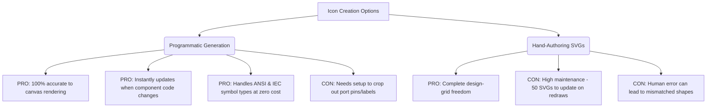

# GGate Icon Creation and Asset Management Plan

This document outlines the strategy for clean, scalable, and standardized icon management in GGate (GTK4 + libadwaita). It addresses existing asset path issues, missing icons, and provides a programmatic workflow for generating component icons directly from the canvas rendering code.

---

## 1. Executive Summary & Core Recommendation

GGate currently suffers from a split asset-delivery model:
1. **Direct Filesystem Lookups:** The side palette ([ComponentView.py](file:///Users/ekureedem/Documents/Projects/GGate/ggate/ComponentView.py)) and context menus ([MenuPopover.py](file:///Users/ekureedem/Documents/Projects/GGate/ggate/MenuPopover.py)) resolve absolute paths relative to local directories, which breaks both inside Python virtual environments and installed system prefixes (e.g., `/usr/lib/python3/...`).
2. **Non-Standard GResource Structure:** The resource compiler config in [dev-resources.xml](file:///Users/ekureedem/Documents/Projects/GGate/data/images/dev-resources.xml) bundles icons under a non-standard hierarchy (`/data/icons/scalable/actions/`), misfiling components under actions and bypassing GTK's native `Gtk.IconTheme` matching engine.
3. **PNG/SVG Mixture & Missing Assets:** Component icons are a mix of PNGs and SVGs. Important toolbar assets (like the specific net connector drawing icon) are missing, forcing fallback placeholders.

### Recommendation: Programmatic Cairo SVG Generation + GResource Theme Mapping
* **For Logic Gates:** Rather than manually drawing 25+ logic gate SVGs twice (for ANSI and IEC styles), we will write a dev-time script (`bin/generate-gate-icons.py`) that instantiates each gate component, evaluates its bounding box, mocks a Cairo `cairo.SVGSurface`, and invokes `drawComponent`. This ensures **100% accuracy**, zero maintenance overhead, and instant updates when canvas drawing code changes.
* **For Infrastructure:** Restructure the resource compile targets using GResource `alias` attributes to conform to the Freedesktop directory spec (`hicolor/scalable/actions` and `hicolor/scalable/devices`). Register the resource base with `Gtk.IconTheme` at startup, and switch all references to standard icon-name lookups (`Gtk.Image.new_from_icon_name`).

---

## 2. Complete Icon Inventory

### A. Logic Gate & Component Palette Icons
These represent the placeable circuit elements loaded in the side palette. Currently, they reside in `data/images/components/`.

| Component Key | Component Name | Current State | Target Format | Generation Style / Notes |
|---|---|---|---|---|
| `definitions.component_NOT` | `not` | PNG only (`not.png`) | SVG (Symbolic) | Programmatic (ANSI & IEC) |
| `definitions.component_AND` | `and` | PNG & SVG | SVG (Symbolic) | Programmatic (ANSI & IEC) |
| `definitions.component_OR` | `or` | PNG & SVG | SVG (Symbolic) | Programmatic (ANSI & IEC) |
| `definitions.component_XOR` | `xor` | PNG only | SVG (Symbolic) | Programmatic (ANSI & IEC) |
| `definitions.component_NAND` | `nand` | SVG only | SVG (Symbolic) | Programmatic (ANSI & IEC) |
| `definitions.component_NOR` | `nor` | SVG only | SVG (Symbolic) | Programmatic (ANSI & IEC) |
| `definitions.component_tribuff` | `tribuff` | PNG only | SVG (Symbolic) | Programmatic (ANSI & IEC) |
| `definitions.component_SW` | `sw` | PNG only | SVG (Symbolic) | Programmatic (ANSI & IEC) |
| `definitions.component_7seg` | `7seg` | SVG only | SVG (Symbolic) | Programmatic (ANSI & IEC) |
| `definitions.component_LED` | `led` | PNG only | SVG (Symbolic) | Programmatic (ANSI & IEC) |
| `definitions.component_VDD` | `vdd` | PNG only | SVG (Symbolic) | Programmatic (ANSI & IEC) |
| `definitions.component_GND` | `gnd` | SVG only | SVG (Symbolic) | Programmatic (ANSI & IEC) |
| `definitions.component_OSC` | `osc` | PNG only | SVG (Symbolic) | Programmatic (ANSI & IEC) |
| `definitions.component_probe` | `probe` | PNG only | SVG (Symbolic) | Programmatic (ANSI & IEC) |
| `definitions.component_text` | `text` | PNG & SVG | SVG (Symbolic) | Programmatic (ANSI & IEC) |
| `definitions.component_RSFF` | `rsff` | SVG only | SVG (Symbolic) | Programmatic (ANSI & IEC) |
| `definitions.component_JKFF` | `jkff` | SVG only | SVG (Symbolic) | Programmatic (ANSI & IEC) |
| `definitions.component_DFF` | `dff` | SVG only | SVG (Symbolic) | Programmatic (ANSI & IEC) |
| `definitions.component_TFF` | `tff` | SVG only | SVG (Symbolic) | Programmatic (ANSI & IEC) |
| `definitions.component_counter` | `counter` | SVG only | SVG (Symbolic) | Programmatic (ANSI & IEC) |
| `definitions.component_adder` | `adder` | SVG only | SVG (Symbolic) | Programmatic (ANSI & IEC) |
| `definitions.component_SISO` | `siso` | SVG only | SVG (Symbolic) | Programmatic (ANSI & IEC) |
| `definitions.component_SIPO` | `sipo` | SVG only | SVG (Symbolic) | Programmatic (ANSI & IEC) |
| `definitions.component_PISO` | `piso` | SVG only | SVG (Symbolic) | Programmatic (ANSI & IEC) |
| `definitions.component_PIPO` | `pipo` | SVG only | SVG (Symbolic) | Programmatic (ANSI & IEC) |

### B. Toolbar & Action Icons
These are used for editor manipulation and toolbar commands in [MainFrame.py](file:///Users/ekureedem/Documents/Projects/GGate/ggate/MainFrame.py).

| Icon Role | Reference Name | Source Type | Current State | Target State / Fix |
|---|---|---|---|---|
| **Rotate Left** | `rotate-left-symbolic` | Custom SVG | SVG (`actions/rotate-left.svg`) | Modernized 16x16 viewbox symbolic |
| **Rotate Right** | `rotate-right-symbolic` | Custom SVG | SVG (`actions/rotate-right.svg`) | Modernized 16x16 viewbox symbolic |
| **Flip Horizontally** | `flip-horizontal-symbolic` | Custom SVG | SVG (`actions/flip-horizontal.svg`) | Modernized 16x16 viewbox symbolic |
| **Flip Vertically** | `flip-vertical-symbolic` | Custom SVG | SVG (`actions/flip-vertical.svg`) | Modernized 16x16 viewbox symbolic |
| **Add Net** | `add-net-symbolic` | Custom SVG | **Missing** (uses fallback `list-add`) | Create custom SVG showing wire symbol |
| **Simulation Start** | `media-playback-start-symbolic` | System | Standard theme icon | Keep standard Freedesktop icon |
| **Simulation Pause** | `media-playback-pause-symbolic` | System | Standard theme icon | Keep standard Freedesktop icon |
| **Simulation Stop** | `media-playback-stop-symbolic` | System | Standard theme icon | Keep standard Freedesktop icon |
| **Open Menu** | `open-menu-symbolic` | System | Standard theme icon | Keep standard Freedesktop icon |

### C. Application & Document Icons
Standard system integration assets.

| Icon Role | Target Name | Size Directory | Current State | Target State |
|---|---|---|---|---|
| **App Launcher Icon** | `org.astralco.GGate.svg` | `scalable/apps` | SVG (`scalable/ggate.svg`) | Scalable SVG (high-res compliant) |
| **App Launcher Icon** | `org.astralco.GGate.png` | `apps/[size]x[size]` | PNGs (`apps/[size]/ggate.png`) | Regenerated from scalable target |
| **GGate Document Icon** | `application-x-ggate-circuit-symbolic.svg` | `scalable/mimetypes` | **Missing** (only PNGs exist) | Scalable SVG representing circuit file |
| **GGate Document Icon** | `application-x-ggate-circuit.png` | `mimetypes/[size]x[size]` | PNGs (`mime/[size]/text-glc.png`) | Rename & regenerate to match MIME spec |

---

## 3. The Accuracy Approach: Programmatic Gate Icon Generation

### Analysis: Programmatic vs. Hand-Authored SVGs



### Recommendation
**Programmatic generation is highly recommended.** 
By executing a generator script in a Python/PyGObject environment, we can dynamically compile the logic gate SVGs. Since the logic gate classes inherit from `BaseComponent` and implement `drawComponent(cr, layout)`, we can reuse their exact drawing functions.

### Implementing Programmatic Cairo Generation
A script named `bin/generate-gate-icons.py` will follow these steps:
1. Initialize GTK and Pango (to load font mappings).
2. For each logic gate registered in `logic_gates` (from `ggate.Components.LogicGates`):
   - Instantiate the component object.
   - Read its bounding box: `rect = component.comp_rect` (e.g. `[10, -40, 100, 0]`).
   - Calculate width and height: `w = rect[2] - rect[0]`, `h = rect[3] - rect[1]`.
   - Apply **Smart Bounding-Box Cropping**: 
     * To draw only the core gate symbol without terminal connector lines or labels, crop the drawing box to the body itself (e.g., cropping the left x-start from 10 to 30 for AND, eliminating the inputs line).
   - Generate two files per component:
     * `gate-[name]-symbolic.svg` (ANSI format: `Preference.symbol_type = 0`).
     * `gate-[name]-iec-symbolic.svg` (IEC format: `Preference.symbol_type = 1`).
   - Create a `cairo.SVGSurface(filepath, w + padding, h + padding)`.
   - Instantiate a PangoCairo layout for text labels.
   - Translate coordinates by `(-rect[0] + padding_x, -rect[1] + padding_y)`.
   - Set standard symbolic stroke styles (`cr.set_line_width(1.5)` and `cr.set_source_rgb(0, 0, 0)`).
   - Execute `component.drawComponent(cr, layout)`.
   - Call `surface.finish()` to flush the SVG vectors to disk.

---

## 4. Canonical SVG Specifications

To ensure crisp rendering and native system integration (especially light/dark mode recoloring), the generated and hand-authored SVGs must strictly adhere to the following specifications:

### A. General Specs
* **Standard Grid (Actions):** 16x16 pixels viewbox with a 1px protective margin (active drawing area: 14x14 pixels).
* **Standard Grid (Components):** 24x24 or 32x32 pixels viewbox.
* **Stroke Alignment:** Stroke centers should align to half-pixels for 1px lines (to remain crisp on pixel grids) and whole pixels for 2px lines.

### B. GTK Symbolic Colors
GTK4 automatically parses and recolors files ending with `-symbolic.svg`. Fills and strokes must use the standard system palette hex codes without adding local inline style blocks that override them:
* **Foreground (Standard):** `#2e3436` (GTK replaces this with the current stylesheet text color: black on light mode, white on dark mode).
* **Accent/Blue:** `#3584e4` (GTK replaces with the theme's active accent color).
* **Destructive/Red:** `#e01b24`
* **Success/Green:** `#2ec27e`
* **Warning/Yellow:** `#e5a50a`
* **Styling Rule:** All paths must use `fill="currentColor"` or standard `#2e3436` with a transparent background. Do not embed gradients, complex shadow filters, or hardcoded white background fills in symbolic files.

---

## 5. Integrating with GResource and Freedesktop Layouts

To allow loading icons strictly by name (e.g., `Gtk.Image.new_from_icon_name("gate-and-symbolic")`), we must configure GResource and Gtk's IconTheme correctly.

### A. Resource Path Restructuring (Using Alias Mapping)
Instead of reorganizing the physical file structure in git, we will map files in [dev-resources.xml](file:///Users/ekureedem/Documents/Projects/GGate/data/images/dev-resources.xml) and [resources.xml.in](file:///Users/ekureedem/Documents/Projects/GGate/data/images/resources.xml.in) using the GResource `alias` attribute:

```xml
<!-- Proposed dev-resources.xml structure -->
<gresource prefix="/org/astralco/GGate/Dev/icons/">
  <!-- Actions -->
  <file alias="hicolor/scalable/actions/flip-horizontal-symbolic.svg">actions/flip-horizontal.svg</file>
  <file alias="hicolor/scalable/actions/flip-vertical-symbolic.svg">actions/flip-vertical.svg</file>
  <file alias="hicolor/scalable/actions/rotate-left-symbolic.svg">actions/rotate-left.svg</file>
  <file alias="hicolor/scalable/actions/rotate-right-symbolic.svg">actions/rotate-right.svg</file>
  <file alias="hicolor/scalable/actions/add-net-symbolic.svg">actions/add-net.svg</file>
  
  <!-- Devices (Logic Gates) -->
  <file alias="hicolor/scalable/devices/gate-and-symbolic.svg">components/and.svg</file>
  <file alias="hicolor/scalable/devices/gate-and-iec-symbolic.svg">components/and-iec.svg</file>
  <file alias="hicolor/scalable/devices/gate-or-symbolic.svg">components/or.svg</file>
  <file alias="hicolor/scalable/devices/gate-or-iec-symbolic.svg">components/or-iec.svg</file>
  <!-- ... remaining 23 gates ... -->
</gresource>
```

### B. Dynamically Building Aliases in Meson
In [data/images/meson.build](file:///Users/ekureedem/Documents/Projects/GGate/data/images/meson.build), we will modify the XML generation loop so Meson generates the aliases automatically during release builds:

```meson
# Proposed data/images/meson.build snippet
icon_files_xml = []
foreach file: icon_files
  parts = file.split('/')
  category = parts[0]   # 'components' or 'actions'
  filename = parts[1]   # e.g., 'and.svg'
  base_name = filename.split('.')[0]

  # Map category to freedesktop context
  context = (category == 'components') ? 'devices' : category
  
  # Format target symbolic name
  if category == 'components'
    # The generator produces both ANSI and IEC files
    # E.g., components/and.svg -> gate-and-symbolic.svg
    # E.g., components/and-iec.svg -> gate-and-iec-symbolic.svg
    alias_name = 'gate-' + base_name + '-symbolic.svg'
  else
    alias_name = base_name + '-symbolic.svg'
  endif

  alias_path = 'hicolor/scalable/' + context + '/' + alias_name
  icon_files_xml += '<file preprocess="xml-stripblanks" alias="' + alias_path + '">' + file + '</file>'
endforeach
```

### C. Application Theme Registration
In [MainFrame.py](file:///Users/ekureedem/Documents/Projects/GGate/ggate/MainFrame.py), replace the old search path hack:
```python
# DEPRECATED
themed_icons.add_search_path(config.DATADIR + "/images")
```

With the native GResource registration inside `do_startup()` of `GLogicApplication`:
```python
# RECOMMENDED
display = Gdk.Display.get_default()
if display:
    theme = Gtk.IconTheme.get_for_display(display)
    # Register the GResource path prefix where GTK will search for icons
    resource_prefix = "/org/astralco/GGate/Dev/icons" if config.DEV_MODE else "/org/astralco/GGate/icons"
    theme.add_resource_path(resource_prefix)
```

### D. Updating Code References
1. **Palette Icons ([ComponentView.py](file:///Users/ekureedem/Documents/Projects/GGate/ggate/ComponentView.py)):**
   Remove direct file paths and check the user preference dynamically:
   ```python
   suffix = "-iec" if Preference.symbol_type == 1 else ""
   icon.set_from_icon_name(f"gate-{gate}{suffix}-symbolic")
   ```
2. **Context Menus ([MenuPopover.py](file:///Users/ekureedem/Documents/Projects/GGate/ggate/MenuPopover.py)):**
   Change custom XML attributes from `verb-icon` (pointing to a path) to the standard `icon` attribute:
   ```xml
   <!-- RECOMMENDED -->
   <item>
     <attribute name="label" translatable="yes">Flip Horizontally</attribute>
     <attribute name="action">menu.flip_hori</attribute>
     <attribute name="icon">flip-horizontal-symbolic</attribute>
   </item>
   ```

---

## 6. Phased Work Plan

### Phase 1: Resource Infrastructure Setup
1. **Meson & GResource Update:** Update [data/images/meson.build](file:///Users/ekureedem/Documents/Projects/GGate/data/images/meson.build) and [dev-resources.xml](file:///Users/ekureedem/Documents/Projects/GGate/data/images/dev-resources.xml) to map resources using the new alias layout.
2. **Theme Registration:** Update [MainFrame.py](file:///Users/ekureedem/Documents/Projects/GGate/ggate/MainFrame.py) to register the `/icons` resource path at startup and delete the legacy `add_search_path` filesystem hack.
3. **Reference Refactoring:** Update `ComponentView.py` and `MenuPopover.py` to load icons by name rather than file paths.

### Phase 2: Programmatic Icon Generation Script
1. **Development of `bin/generate-gate-icons.py`:** Write and refine the programmatic Cairo SVG generation script.
2. **Smart Cropping Adjustment:** Run tests to define the exact cropping limits for each of the 25 components to ensure ports/wires are excluded while logic gate symbols look crisp.
3. **Generation:** Run the script to generate all 50 SVGs (25 ANSI, 25 IEC) and write them to `data/images/components/`.

### Phase 3: Hand-Authored Assets & System Files
1. **Action Icons:** Update `flip-horizontal.svg`, `flip-vertical.svg`, `rotate-left.svg`, and `rotate-right.svg` to be 16x16 symbolic SVGs.
2. **Net Icon:** Design the missing `add-net-symbolic.svg` showing a clean vector wire segment.
3. **App & MIME Icons:** Modernize `org.astralco.GGate.svg` and `application-x-ggate-circuit-symbolic.svg`, then update Meson file installers and setup configs to deploy them to standard directories.

### Phase 4: Verification & Testing
1. **Theme Switch Verification:** Verify that toggling between ANSI and IEC symbols updates the ComponentView icons on the fly.
2. **Light/Dark Mode Check:** Test the application in both light mode and dark mode to ensure GTK recolors all symbolic icons correctly.
3. **Distribution Verification:** Run Flatpak and Snap packaging builds to confirm that compiled `.gresource` files and desktop icon registries load without warning messages.

---

## 7. Open Questions for the PM

1. **Terminal Pins in Component Icons:** Do we want the gate icons in the sidebar to display the small terminal connection dots on the margins, or should we crop them strictly to the gate symbol body? (Cropping them out is recommended for cleaner, less cluttered icons in the sidebar list).
2. **Custom Actions vs. Standard GTK Icons:** For common operations like flip or rotate, should we use our custom logic-gate-themed flip/rotate icons (which reflect a buffer shape), or should we use standard system desktop icons like `object-flip-horizontal-symbolic`? (We recommend keeping the custom buffer-based icons as they reinforce the circuit-editing domain).
3. **Dynamic Component View Refresh:** Should the component view sidebar listen to preference changes and refresh its icons instantly when the user toggles ANSI/IEC symbol types, or is it acceptable to require an application restart for the sidebar icons to switch? (Dynamic updating is highly recommended and simple to implement by listening to setting notifications).
