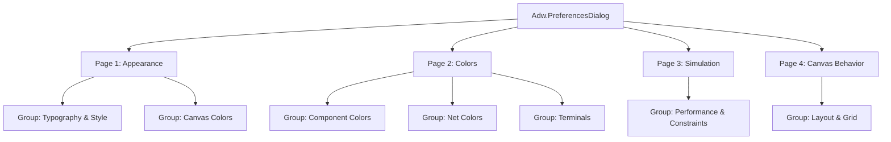

# PLAN: Preferences UI Revamp

This document outlines the design and migration plan for updating GGate's preferences window from a deprecated `Gtk.Dialog` to a modern, adaptive `Adw.PreferencesDialog`.

> [!NOTE]
> This is a planning-only document. No application code will be modified during this task.

---

## 1. Inventory of Current Settings

GGate stores user settings globally in [Preference.py](file:///Users/ekureedem/Documents/Projects/GGate/ggate/Preference.py). The following table catalogues every setting, its type, default value, purpose, and the widget used in the current UI:

| Setting Key | Data Type | Default Value | Controls / Description | Current UI Widget |
| :--- | :--- | :--- | :--- | :--- |
| `drawing_font` | `Pango.FontDescription` | `"Liberation Mono 10"` | Font family and size for component label drawing | `Gtk.FontDialogButton` (Broken/unconfigured) |
| `symbol_type` | `int` | `0` (MIL/ANSI) | Symbol style for logic gates (0: MIL/ANSI, 1: IEC) | `Gtk.ComboBoxText` |
| `max_calc_iters` | `int` | `10000` | Max iterations per simulation step | `Gtk.SpinButton` |
| `max_calc_duration` | `float` | `0.0002` (seconds) | Max calculation step duration (shown in µs in UI) | `Gtk.SpinButton` (multiplied by $10^6$ for µs) |
| `autocenter_resize` | `int` (as bool) | `1` (ON) | Automatically center canvas bounding box on resize | `Gtk.Switch` |
| `grid_step` | `int` | `10` | Grid spacing distance in pixels on canvas | *None (Hidden setting)* |
| `net_color` | `cairo.SolidPattern` | `0.0, 0.0, 1.0` (Blue) | Default net color in edit mode | `Gtk.ColorButton` |
| `net_high_color` | `cairo.SolidPattern` | `0.5, 0.5, 1.0` | Color of highlighted nets | `Gtk.ColorButton` |
| `net_color_running` | `cairo.SolidPattern` | `0.0, 0.0, 0.0` (Black) | Color of un-powered nets in simulation mode | `Gtk.ColorButton` |
| `highlevel_color` | `cairo.SolidPattern` | `1.0, 0.0, 0.0` (Red) | Color of high logic level (1) nets | `Gtk.ColorButton` |
| `lowlevel_color` | `cairo.SolidPattern` | `0.0, 0.0, 1.0` (Blue) | Color of low logic level (0) nets | `Gtk.ColorButton` |
| `component_color` | `cairo.SolidPattern` | `0.0, 1.0, 0.0` (Green) | Default component stroke in edit mode | `Gtk.ColorButton` |
| `component_high_color` | `cairo.SolidPattern` | `0.5, 1.0, 0.5` | Color of highlighted components | `Gtk.ColorButton` |
| `component_color_running` | `cairo.SolidPattern` | `0.0, 0.0, 0.0` (Black) | Color of components in simulation mode | `Gtk.ColorButton` |
| `picked_color` | `cairo.SolidPattern` | `1.0, 0.5, 0.0` (Orange) | Color of components currently being moved | `Gtk.ColorButton` |
| `preadd_color` | `cairo.SolidPattern` | `1.0, 0.75, 0.0` | Color of components before placement preview | `Gtk.ColorButton` |
| `selected_color` | `cairo.SolidPattern` | `1.0, 1.0, 1.0` (White) | Color of selected components | `Gtk.ColorButton` |
| `terminal_color` | `cairo.SolidPattern` | `1.0, 0.0, 0.0` (Red) | Color of terminals/pins in edit mode | `Gtk.ColorButton` |
| `terminal_color_running` | `cairo.SolidPattern` | `0.0, 0.0, 0.0` (Black) | Color of terminals/pins in simulation mode | `Gtk.ColorButton` |
| `cursor_color` | `cairo.SolidPattern` | `1.0, 1.0, 1.0` (White) | Color of snapping placement cursor | `Gtk.ColorButton` |
| `bg_color` | `cairo.SolidPattern` | `0.0, 0.0, 0.0` (Black) | Canvas background color in edit mode | `Gtk.ColorButton` |
| `bg_color_running` | `cairo.SolidPattern` | `1.0, 1.0, 1.0` (White) | Canvas background color in simulation mode | `Gtk.ColorButton` |
| `grid_color` | `cairo.SolidPattern` | `0.15, 0.12, 0.15` | Color of grid dots/lines | `Gtk.ColorButton` |

*Note: Internal patterns starting with `_` (`_red`, `_green`, `_blue`, `_yellow`) and selection box colors (`selection_box`, `selection_box_border`) are stored in `Preference.py` but excluded from user modification UI.*

---

## 2. Proposed Tab & Page Structure

We will transition the dialog structure to a set of sub-pages within `Adw.PreferencesDialog`. This provides an adaptive sidebar/header layout with search capabilities.



### Page 1: Appearance (Title: `Appearance`, Icon: `preferences-desktop-wallpaper-symbolic`)

#### Group 1: Typography & Style
*   **Drawing Font**
    *   *Adw Row Type:* `Adw.ActionRow` containing a `Gtk.FontDialogButton` suffix.
    *   *Mapping:* Live-binds to `Preference.drawing_font` (`Pango.FontDescription`).
*   **Symbol Style**
    *   *Adw Row Type:* `Adw.ComboRow`
    *   *Model:* `Gtk.StringList.new([_("MIL/ANSI"), _("IEC")])`
    *   *Mapping:* Live-binds to `Preference.symbol_type` (`int`, index).

#### Group 2: Canvas Colors
*   **Background (Edit Mode)**
    *   *Adw Row Type:* `Adw.ActionRow` containing a `Gtk.ColorDialogButton` suffix.
    *   *Mapping:* Live-binds to `Preference.bg_color` (RGB string mapping).
*   **Background (Running Mode)**
    *   *Adw Row Type:* `Adw.ActionRow` containing a `Gtk.ColorDialogButton` suffix.
    *   *Mapping:* Live-binds to `Preference.bg_color_running`.
*   **Grid Color**
    *   *Adw Row Type:* `Adw.ActionRow` containing a `Gtk.ColorDialogButton` suffix.
    *   *Mapping:* Live-binds to `Preference.grid_color`.
*   **Cursor Color**
    *   *Adw Row Type:* `Adw.ActionRow` containing a `Gtk.ColorDialogButton` suffix.
    *   *Mapping:* Live-binds to `Preference.cursor_color`.

---

### Page 2: Colors (Title: `Colors`, Icon: `applications-graphics-symbolic`)

#### Group 1: Component Colors
*   **Component (Default)**
    *   *Adw Row Type:* `Adw.ActionRow` with `Gtk.ColorDialogButton` suffix.
    *   *Mapping:* `Preference.component_color`
*   **Component (Highlighted)**
    *   *Adw Row Type:* `Adw.ActionRow` with `Gtk.ColorDialogButton` suffix.
    *   *Mapping:* `Preference.component_high_color`
*   **Component (Running)**
    *   *Adw Row Type:* `Adw.ActionRow` with `Gtk.ColorDialogButton` suffix.
    *   *Mapping:* `Preference.component_color_running`
*   **Component (Picked)**
    *   *Adw Row Type:* `Adw.ActionRow` with `Gtk.ColorDialogButton` suffix.
    *   *Mapping:* `Preference.picked_color`
*   **Component (Pre-added)**
    *   *Adw Row Type:* `Adw.ActionRow` with `Gtk.ColorDialogButton` suffix.
    *   *Mapping:* `Preference.preadd_color`
*   **Component (Selected)**
    *   *Adw Row Type:* `Adw.ActionRow` with `Gtk.ColorDialogButton` suffix.
    *   *Mapping:* `Preference.selected_color`

#### Group 2: Net Colors
*   **Net (Default)**
    *   *Adw Row Type:* `Adw.ActionRow` with `Gtk.ColorDialogButton` suffix.
    *   *Mapping:* `Preference.net_color`
*   **Net (Highlighted)**
    *   *Adw Row Type:* `Adw.ActionRow` with `Gtk.ColorDialogButton` suffix.
    *   *Mapping:* `Preference.net_high_color`
*   **Net (Running)**
    *   *Adw Row Type:* `Adw.ActionRow` with `Gtk.ColorDialogButton` suffix.
    *   *Mapping:* `Preference.net_color_running`
*   **Net (High Level)**
    *   *Adw Row Type:* `Adw.ActionRow` with `Gtk.ColorDialogButton` suffix.
    *   *Mapping:* `Preference.highlevel_color`
*   **Net (Low Level)**
    *   *Adw Row Type:* `Adw.ActionRow` with `Gtk.ColorDialogButton` suffix.
    *   *Mapping:* `Preference.lowlevel_color`

#### Group 3: Terminals
*   **Terminal (Edit)**
    *   *Adw Row Type:* `Adw.ActionRow` with `Gtk.ColorDialogButton` suffix.
    *   *Mapping:* `Preference.terminal_color`
*   **Terminal (Running)**
    *   *Adw Row Type:* `Adw.ActionRow` with `Gtk.ColorDialogButton` suffix.
    *   *Mapping:* `Preference.terminal_color_running`

---

### Page 3: Simulation (Title: `Simulation`, Icon: `media-playback-start-symbolic`)

#### Group 1: Performance & Constraints
*   **Max Calculation Iterations**
    *   *Adw Row Type:* `Adw.SpinRow`
    *   *Range:* $10$ to $1,000,000$, step $1.0$ (digits: 0, numeric: True).
    *   *Mapping:* Live-binds to `Preference.max_calc_iters` (`int`).
*   **Max Calculation Duration (µs)**
    *   *Adw Row Type:* `Adw.SpinRow`
    *   *Range:* $0$ to $100,000$, step $1.0$ (digits: 3, numeric: True).
    *   *Mapping:* `Preference.max_calc_duration` (float, display value equals seconds multiplied by $10^6$).

---

### Page 4: Canvas Behavior (Title: `Canvas`, Icon: `input-mouse-symbolic`)

#### Group 1: Layout & Grid
*   **Auto-Center Content on Resize**
    *   *Adw Row Type:* `Adw.SwitchRow`
    *   *Mapping:* Live-binds to `Preference.autocenter_resize` (`0` or `1`).
*   **Grid Step Size (px)**
    *   *Adw Row Type:* `Adw.SpinRow`
    *   *Range:* $5$ to $50$, step $1.0$ (digits: 0, numeric: True).
    *   *Mapping:* Live-binds to the previously hidden `Preference.grid_step` (`int`).

---

## 3. Load / Apply Wiring: Live Binding vs. Explicit Apply

In the current architecture, settings are modified via an explicit dialog cycle:
1. Dialog reads values into widgets via `update_dialog()`.
2. User edits widgets.
3. User clicks **Apply** (which runs `apply_settings()` and saves settings) or **Cancel** (which discards inputs).

### The Modern Adwaita Pattern: Instant-Apply (Live Binding)
Modern GNOME Human Interface Guidelines (HIG) reject "Cancel/Apply" preference modals. Instead, preferences are **instant-apply**: settings apply in real-time as widgets change.

We plan to implement **Instant-Apply** for GGate.

#### Real-time Wiring Workflow
1.  **Instantiation:**
    `PreferencesWindow` will subclass `Adw.PreferencesDialog` and accept a reference to the `MainFrame` parent:
    ```python
    class PreferencesWindow(Adw.PreferencesDialog):
        def __init__(self, parent):
            super().__init__()
            self.set_transient_for(parent)
            self.main_frame = parent
            self.build_ui()
    ```
2.  **Initial Population (No-Signal Stage):**
    We construct widgets and set their values from `Preference` attributes *before* connecting change signals. This avoids triggering false change events during widget creation.
3.  **Signal Binding:**
    Once loaded, row properties connect to a shared update logic:
    *   `SwitchRow` -> `notify::active`
    *   `ComboRow` -> `notify::selected`
    *   `SpinRow` -> `notify::value`
    *   `Gtk.ColorDialogButton` -> `notify::rgba`
    *   `Gtk.FontDialogButton` -> `notify::font-desc`
4.  **Shared Event Handling:**
    On change, we update `Preference`, write to disk, and redraw the canvas:
    ```python
    def _on_color_changed(self, button, pspec, key):
        rgba = button.get_rgba()
        Preference.__setattr__(key, f"{rgba.red},{rgba.green},{rgba.blue}")
        Preference.save_settings()
        self._trigger_canvas_redraw()

    def _trigger_canvas_redraw(self):
        if self.main_frame and hasattr(self.main_frame, "drawarea"):
            self.main_frame.drawarea.redraw = True
            self.main_frame.drawarea.queue_draw()
    ```

> [!TIP]
> In `MainFrame.py`, the old callback response handler `_prefs_changed()` and dialog re-instantiation logic can be removed completely. Showing the preferences window becomes a simple:
> ```python
> def on_action_prefs_pressed(self, *widget):
>     PreferencesWindow(self).present()
> ```

---

## 4. Migration Notes & Risks

### 1. Font Picker Fix (`Gtk.FontDialogButton`)
The current code throws a TODO regarding the font picker:
```python
# todo: fix font picker
self.drawing_font_btn = Gtk.FontDialogButton()
```
*   **Why it's broken:** In GTK4, a `Gtk.FontDialogButton` cannot show a font selector window unless it has an associated `Gtk.FontDialog` object.
*   **The Fix:** Construct a helper `Gtk.FontDialog` and set it on the button:
    ```python
    font_dialog = Gtk.FontDialog()
    self.drawing_font_btn = Gtk.FontDialogButton.new(font_dialog)
    # Alternatively:
    # self.drawing_font_btn.set_dialog(font_dialog)
    ```

### 2. Color Pickers (`Gtk.ColorDialogButton`)
The current code uses the legacy `Gtk.ColorButton` widget. Because GGate targets GTK4 $\ge$ 4.16:
*   We should migrate to the modern `Gtk.ColorDialogButton` (introduced in GTK 4.10) to avoid deprecation warnings.
*   Similar to the font picker, `Gtk.ColorDialogButton` requires a `Gtk.ColorDialog` context:
    ```python
    color_dialog = Gtk.ColorDialog()
    btn = Gtk.ColorDialogButton.new(color_dialog)
    ```

### 3. Removal of `Gtk.Dialog` Architecture
*   Since `Adw.PreferencesDialog` subclasses `Adw.Dialog`, we don't need manual title-bar configuration, margins, scrolling, or action-area buttons. Removing them simplifies `Preferences.py` from 204 lines of layout boilerplate to roughly 100 lines of declarative groupings.

---

## 5. Open Questions for the PM

Before the implementation phase, the PM should clarify the following design decisions:

1.  **Exposing `grid_step`:**
    Should we expose the canvas grid size setting to the user? (Currently it exists in `Preference.py` default `10` but is hidden. We recommend adding it under a "Canvas" tab).
2.  **Exposing selection box colors:**
    Should `selection_box` (default RGBA `1, 0.75, 0, 0.25`) and `selection_box_border` (default RGB `1, 0.75, 0`) also be added to the Colors page, or should they remain hardcoded?
3.  **Light/Dark and System Style Integration:**
    Libadwaita supports the system dark style preference via `Adw.StyleManager`. Since GGate has manual canvas edit/run backgrounds, should we allow matching the system color scheme (automatically switching backgrounds), or keep backgrounds fully manual?
4.  **Drawing Font Restriction:**
    Should the font chooser be limited to Monospaced fonts (which render labels more cleanly on a logic gate schematic), or let the user choose any system font?

---

## 6. PM Decisions (2026-06-14)

1. **grid_step** — do NOT expose yet. Keep hidden in `Preference.py`; drop the "Grid Step Size" row from the Canvas page (Canvas page then holds only Auto-Center).
2. **selection-box colors** (`selection_box`, `selection_box_border`) — do NOT expose yet. Keep hardcoded; omit from the Colors page.
3. **System dark/light (`Adw.StyleManager`)** — keep canvas colors **manual**. No automatic system-scheme integration; a proper theming system is planned separately later.
4. **Drawing font** — **monospace only.** Configure the `Gtk.FontDialog` to restrict selection to monospaced fonts.

Implementation must honor these: no grid-step row, no selection-box rows, no `StyleManager` wiring, monospace-restricted font picker.
