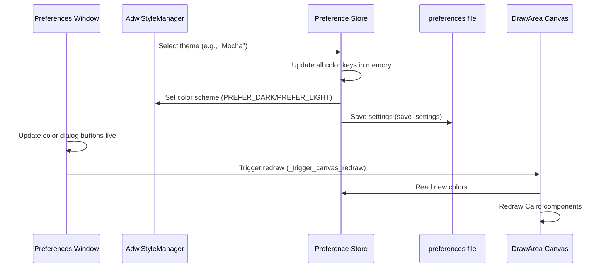
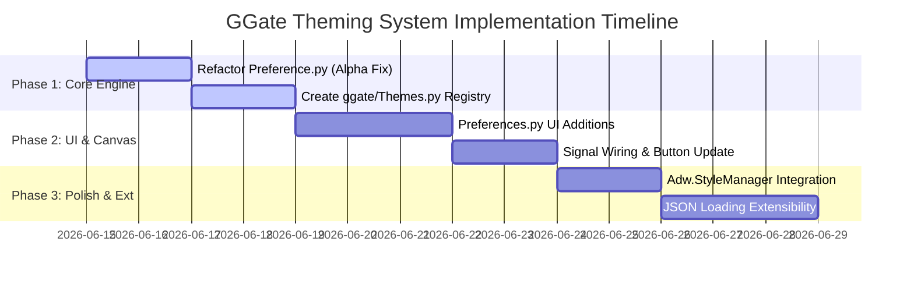

# GGate Theming System Design Plan

This document outlines the architecture, data structures, UI integration, and implementation roadmap for a canvas and app-wide theming system in GGate.

## Overview

GGate is a GTK4 + libadwaita application with a Cairo-rendered canvas. Currently, canvas colors are loaded from a flat set of keys in [Preference.py](file:///Users/ekureedem/Documents/Projects/GGate/ggate/Preference.py) and edited individually via the Appearance page in [Preferences.py](file:///Users/ekureedem/Documents/Projects/GGate/ggate/Components/Windows/Preferences.py). 

The goal of this design is to implement a unified **Theming System** containing three preinstalled premium dark/neutral themes:
1. **Space**: A custom designed dark, deep-space aesthetic.
2. **Frappé**: The official Catppuccin Frappé palette.
3. **Mocha**: The official Catppuccin Mocha palette.

---

## 1. Architecture

The theming system separates **theme definitions** (color palettes) from the active **preference settings**.

### Theme Representation
A theme will be represented in code as a dictionary mapping each color-based GGate Preference key to a standard hexadecimal string (e.g., `#1e1e2e` or `#cba6f733` with alpha). 

A new module [ggate/Themes.py](file:///Users/ekureedem/Documents/Projects/GGate/ggate/Themes.py) will house the theme registries, containing the built-in themes and parsing helpers.

```python
# ggate/Themes.py
from gi.repository import Gdk
import cairo

class Theme:
    def __init__(self, name: str, dark_chrome: bool, colors: dict[str, str]):
        self.name = name
        self.dark_chrome = dark_chrome  # True to prefer dark app chrome
        self.colors = colors

    def get_pattern(self, key: str) -> cairo.SolidPattern:
        hex_val = self.colors.get(key)
        if not hex_val:
            return cairo.SolidPattern(0.0, 0.0, 0.0)
        return hex_to_pattern(hex_val)
```

### Flow & Serialization
A new setting key `"theme"` (type `str`, defaults to `"Space"`) will be added to the preference dictionary in `Preference.py` to persist the active theme's name.



### Resolving the Selection Box Alpha Bug
Currently, GGate's preferences file parses values with commas and discards alpha settings when loading/saving:
* `cairo.SolidPattern.get_rgba()` returns `(r, g, b, a)`.
* `Preference.py:save_settings()` writes `%s=%f,%f,%f\n`.
* `Preference.py:__setattr__()` parses only three elements, setting alpha implicitly to `1.0`.

To support the translucent `selection_box` color without hardcoding alpha values, the serialization logic in `Preference.py` must be upgraded to support optional alpha:

```python
# Proposed serialization fix in Preference.py
elif isinstance(self.pref_dict[key], cairo.Pattern):
    rgba = self.pref_dict[key].get_rgba()
    if rgba[3] < 1.0:
        fp.write("%s=%f,%f,%f,%f\n" % (key, rgba[0], rgba[1], rgba[2], rgba[3]))
    else:
        fp.write("%s=%f,%f,%f\n" % (key, rgba[0], rgba[1], rgba[2]))

# Proposed parsing fix in Preference.py
elif isinstance(self.pref_dict[name], cairo.Pattern):
    try:
        rgba_vals = [float(x) for x in value.split(",")]
        if len(rgba_vals) == 4:
            self.pref_dict[name] = cairo.SolidPattern(*rgba_vals)
        else:
            self.pref_dict[name] = cairo.SolidPattern(rgba_vals[0], rgba_vals[1], rgba_vals[2], 1.0)
    except (ValueError, IndexError):
        self.pref_dict[name] = cairo.SolidPattern(0.0, 0.0, 0.0)
```

### Coexistence with Manual Tweaks
GGate supports tweaking individual colors. To coexist with the preset theme dropdown:
1. When a user picks a theme (e.g., `"Mocha"`), GGate loads all colors from that theme into the preferences and sets `"theme" = "Mocha"`.
2. If the user subsequently updates any individual color via the color button picker, the value of `"theme"` is updated to `"Custom"`.
3. The dropdown in the UI changes to show `"Custom"`, indicating that a user is overriding the baseline theme.

---

## 2. Full Palette Mapping

Below are the exhaustive hex and Cairo float maps for all 23 GGate color preference keys across the three themes. 

> [!NOTE]
> Cairo float values (`r, g, b, [a]`) represent the Red, Green, Blue, and Alpha channels mapped between `0.0` and `1.0`. They are computed by dividing the 8-bit hex channel by `255.0` (rounded to 3 decimal places).

### Theme 1: "Space" (Custom Dark Cyberpunk/Deep Void Theme)
A vibrant, neon-accented dark palette designed specifically to look premium on GGate's circuit logic canvas.

| Preference Key | GGate Canvas Element | Hex Color | Cairo Float Value (`r, g, b, [a]`) |
| :--- | :--- | :--- | :--- |
| `bg_color` | Canvas Background (Edit mode) | `#07080d` | `(0.027, 0.031, 0.051)` |
| `bg_color_running` | Canvas Background (Running mode) | `#0c0e16` | `(0.047, 0.055, 0.086)` |
| `grid_color` | Grid alignment lines | `#1b1e2c` | `(0.106, 0.118, 0.173)` |
| `cursor_color` | Coordinate snap dot/cursor | `#e5e8f4` | `(0.898, 0.910, 0.957)` |
| `component_color` | Logic gates border (Edit mode) | `#3d64ff` | `(0.239, 0.392, 1.000)` |
| `component_high_color` | Hovered/Highlighted logic gate | `#00f2fe` | `(0.000, 0.949, 0.996)` |
| `component_color_running` | Component border (Running mode) | `#8992a8` | `(0.537, 0.573, 0.659)` |
| `picked_color` | Gate currently selected & moving | `#ff8000` | `(1.000, 0.502, 0.000)` |
| `preadd_color` | Ghost component before placement | `#ff007f` | `(1.000, 0.000, 0.498)` |
| `selected_color` | Border of selected components | `#39ff14` | `(0.224, 1.000, 0.078)` |
| `net_color` | Wire segments (Edit mode) | `#5b637a` | `(0.357, 0.388, 0.478)` |
| `net_high_color` | Hovered wire segment | `#00f2fe` | `(0.000, 0.949, 0.996)` |
| `net_color_running` | Indeterminate wire state (Running) | `#44495b` | `(0.267, 0.286, 0.357)` |
| `highlevel_color` | Logic state 1 (High wire) | `#39ff14` | `(0.224, 1.000, 0.078)` |
| `lowlevel_color` | Logic state 0 (Low wire) | `#3d64ff` | `(0.239, 0.392, 1.000)` |
| `terminal_color` | Pin connection terminal (Edit) | `#ff3b30` | `(1.000, 0.145, 0.118)` |
| `terminal_color_running` | Pin connection terminal (Running) | `#07080d` | `(0.027, 0.031, 0.051)` |
| `selection_box` | Multi-select fill region | `#00f2fe26` | `(0.000, 0.949, 0.996, 0.150)` |
| `selection_box_border` | Multi-select border outline | `#00f2fe` | `(0.000, 0.949, 0.996)` |
| `_red` | State LED Red | `#ff3b30` | `(1.000, 0.145, 0.118)` |
| `_green` | State LED Green | `#39ff14` | `(0.224, 1.000, 0.078)` |
| `_blue` | State LED Blue | `#007aff` | `(0.000, 0.478, 1.000)` |
| `_yellow` | State LED Yellow | `#ffcc00` | `(1.000, 0.800, 0.000)` |

### Theme 2: "Frappé" (Catppuccin Frappé)
A dark theme utilizing the official, muted, pastel-toned colors of Catppuccin Frappé.

| Preference Key | GGate Canvas Element | Hex Color | Cairo Float Value (`r, g, b, [a]`) |
| :--- | :--- | :--- | :--- |
| `bg_color` | Canvas Background (Edit mode) | `#303446` | `(0.188, 0.204, 0.275)` |
| `bg_color_running` | Canvas Background (Running mode) | `#292c3c` | `(0.161, 0.173, 0.235)` |
| `grid_color` | Grid alignment lines | `#414559` | `(0.255, 0.271, 0.349)` |
| `cursor_color` | Coordinate snap dot/cursor | `#babbf1` | `(0.729, 0.733, 0.945)` |
| `component_color` | Logic gates border (Edit mode) | `#8caaee` | `(0.549, 0.667, 0.933)` |
| `component_high_color` | Hovered/Highlighted logic gate | `#85c1dc` | `(0.522, 0.757, 0.863)` |
| `component_color_running` | Component border (Running mode) | `#c6d0f5` | `(0.776, 0.816, 0.961)` |
| `picked_color` | Gate currently selected & moving | `#ef9f76` | `(0.937, 0.624, 0.463)` |
| `preadd_color` | Ghost component before placement | `#eebebe` | `(0.933, 0.745, 0.745)` |
| `selected_color` | Border of selected components | `#ca9ee6` | `(0.792, 0.620, 0.902)` |
| `net_color` | Wire segments (Edit mode) | `#838ba7` | `(0.514, 0.545, 0.655)` |
| `net_high_color` | Hovered wire segment | `#99d1db` | `(0.600, 0.820, 0.859)` |
| `net_color_running` | Indeterminate wire state (Running) | `#737994` | `(0.451, 0.475, 0.580)` |
| `highlevel_color` | Logic state 1 (High wire) | `#a6d189` | `(0.651, 0.820, 0.537)` |
| `lowlevel_color` | Logic state 0 (Low wire) | `#8caaee` | `(0.549, 0.667, 0.933)` |
| `terminal_color` | Pin connection terminal (Edit) | `#e78284` | `(0.906, 0.510, 0.518)` |
| `terminal_color_running` | Pin connection terminal (Running) | `#232634` | `(0.137, 0.149, 0.204)` |
| `selection_box` | Multi-select fill region | `#ca9ee633` | `(0.792, 0.620, 0.902, 0.200)` |
| `selection_box_border` | Multi-select border outline | `#ca9ee6` | `(0.792, 0.620, 0.902)` |
| `_red` | State LED Red | `#e78284` | `(0.906, 0.510, 0.518)` |
| `_green` | State LED Green | `#a6d189` | `(0.651, 0.820, 0.537)` |
| `_blue` | State LED Blue | `#8caaee` | `(0.549, 0.667, 0.933)` |
| `_yellow` | State LED Yellow | `#e5c890` | `(0.898, 0.784, 0.565)` |

### Theme 3: "Mocha" (Catppuccin Mocha)
A high-contrast deep dark theme utilizing the official colors of Catppuccin Mocha.

| Preference Key | GGate Canvas Element | Hex Color | Cairo Float Value (`r, g, b, [a]`) |
| :--- | :--- | :--- | :--- |
| `bg_color` | Canvas Background (Edit mode) | `#1e1e2e` | `(0.118, 0.118, 0.180)` |
| `bg_color_running` | Canvas Background (Running mode) | `#181825` | `(0.094, 0.094, 0.145)` |
| `grid_color` | Grid alignment lines | `#313244` | `(0.192, 0.196, 0.267)` |
| `cursor_color` | Coordinate snap dot/cursor | `#b4befe` | `(0.706, 0.745, 0.996)` |
| `component_color` | Logic gates border (Edit mode) | `#89b4fa` | `(0.537, 0.706, 0.980)` |
| `component_high_color` | Hovered/Highlighted logic gate | `#74c7ec` | `(0.455, 0.780, 0.925)` |
| `component_color_running` | Component border (Running mode) | `#cdd6f4` | `(0.804, 0.839, 0.957)` |
| `picked_color` | Gate currently selected & moving | `#fab387` | `(0.980, 0.702, 0.529)` |
| `preadd_color` | Ghost component before placement | `#f2cdcd` | `(0.949, 0.804, 0.804)` |
| `selected_color` | Border of selected components | `#cba6f7` | `(0.796, 0.651, 0.969)` |
| `net_color` | Wire segments (Edit mode) | `#7f849c` | `(0.498, 0.518, 0.612)` |
| `net_high_color` | Hovered wire segment | `#89dceb` | `(0.537, 0.863, 0.922)` |
| `net_color_running` | Indeterminate wire state (Running) | `#6c7086` | `(0.424, 0.439, 0.525)` |
| `highlevel_color` | Logic state 1 (High wire) | `#a6e3a1` | `(0.651, 0.890, 0.631)` |
| `lowlevel_color` | Logic state 0 (Low wire) | `#89b4fa` | `(0.537, 0.706, 0.980)` |
| `terminal_color` | Pin connection terminal (Edit) | `#f38ba8` | `(0.953, 0.545, 0.659)` |
| `terminal_color_running` | Pin connection terminal (Running) | `#11111b` | `(0.067, 0.067, 0.106)` |
| `selection_box` | Multi-select fill region | `#cba6f733` | `(0.796, 0.651, 0.969, 0.200)` |
| `selection_box_border` | Multi-select border outline | `#cba6f7` | `(0.796, 0.651, 0.969)` |
| `_red` | State LED Red | `#f38ba8` | `(0.953, 0.545, 0.659)` |
| `_green` | State LED Green | `#a6e3a1` | `(0.651, 0.890, 0.631)` |
| `_blue` | State LED Blue | `#89b4fa` | `(0.537, 0.706, 0.980)` |
| `_yellow` | State LED Yellow | `#f9e2af` | `(0.976, 0.886, 0.686)` |

---

## 3. Preferences UI Integration

The theme picker will be integrated into the top of the **Appearance** tab of the Preferences window (`ggate/Components/Windows/Preferences.py`), above the typography and color groups.

```
+----------------------------------------------------+
|                      Preferences                   |
+----------------------------------------------------+
|  Appearance    Simulation    Canvas                |
|                                                    |
|  Theme                                             |
|    Theme Style........................ [ Mocha v]  |
|                                                    |
|  Typography & Style                                |
|    Font....................... [ Liberation Mono ]  |
|    Symbol style...................... [ MIL/ANSI ] |
|                                                    |
|  Canvas Colors                                     |
|    Background (edit mode)............. [ Color ]   |
|    Background (running)............... [ Color ]   |
|    ...                                             |
+----------------------------------------------------+
```

### UI Implementation Details
1. **ComboRow Addition**: An `Adw.ComboRow` with title "Theme Style" will be added at the top. The model will be populated with `"Space"`, `"Frappé"`, `"Mocha"`, and `"Custom"`.
2. **Signal Hook**: The ComboRow's `"notify::selected"` property is connected to `_on_theme_changed`.
3. **Updating values live**: When a theme is selected, the handler will load the preset dictionary, write each color to the respective preference in `Preference.py`, and immediately update the color button instances using `btn.set_rgba(rgba)` so the UI color rows update instantly.
4. **Trigger Redraw**: The handler will invoke `self._trigger_canvas_redraw()` to update the canvas in real time.
5. **Color Button Integration**: When an individual color button is adjusted, its signal handler will set the theme `ComboRow` selection index to `"Custom"` (and set the Preference theme key to `"Custom"`).

---

## 4. App Chrome Styling Recommendation

**Recommendation**: GGate should automatically align the libadwaita application chrome with the active canvas theme to avoid visual dissonance (such as displaying a bright white window header and sidebar next to a dark space canvas).

* **Color Scheme Integration**: 
  - Space, Frappé, and Mocha are dark themes. Selecting them should trigger the `Adw.StyleManager` to prefer dark mode:
    ```python
    Adw.StyleManager.get_default().set_color_scheme(Adw.ColorScheme.PREFER_DARK)
    ```
  - If a light theme is added later (e.g., Catppuccin Latte), it should trigger `Adw.ColorScheme.PREFER_LIGHT`.
  - Setting the color scheme to `"Custom"` should default back to system preferences (`Adw.ColorScheme.DEFAULT`).
* **Accent Colors**: 
  - For GTK4/Adwaita accent highlights (e.g., active switches, focused text entries, header selections), we can dynamically apply accent-specific styles to match each theme:
    - **Space**: Electric Cyan (`#00f2fe`)
    - **Frappé**: Lavender (`#babbf1`) or Mauve (`#ca9ee6`)
    - **Mocha**: Lavender (`#b4befe`) or Mauve (`#cba6f7`)
  - Accent coloring can be applied using `Gtk.CssProvider` loaded into the default screen, defining custom Adwaita color overrides (`@accent_color` and `@accent_bg_color`).

---

## 5. Extensibility

A future-proof extension architecture will enable users to place custom `.json` themes in their config directory (`~/.config/ggate/themes/`).

### Theme JSON Schema
```json
{
  "name": "Nord Void",
  "dark_chrome": true,
  "colors": {
    "bg_color": "#2e3440",
    "bg_color_running": "#242933",
    "grid_color": "#3b4252",
    "cursor_color": "#d8dee9",
    "component_color": "#81a1c1",
    "component_high_color": "#88c0d0",
    "component_color_running": "#d8dee9",
    "picked_color": "#d08770",
    "preadd_color": "#b48ead",
    "selected_color": "#a3be8c",
    "net_color": "#4c566a",
    "net_high_color": "#88c0d0",
    "net_color_running": "#434c5e",
    "highlevel_color": "#a3be8c",
    "lowlevel_color": "#81a1c1",
    "terminal_color": "#bf616a",
    "terminal_color_running": "#2e3440",
    "selection_box": "#88c0d033",
    "selection_box_border": "#88c0d0",
    "_red": "#bf616a",
    "_green": "#a3be8c",
    "_blue": "#81a1c1",
    "_yellow": "#ebcb8b"
  }
}
```

### Loading Mechanism
On startup, GGate's preferences loading routine will scan `definitions.config_path + "/themes/"` for `.json` files. For each valid file:
1. Parse it and instantiate a `Theme` object.
2. Register it in the theme dictionary in `ggate/Themes.py`.
3. Dynamically populate the `Adw.ComboRow` with the custom theme names.

---

## 6. Phased Implementation Plan



### Phase 1: Core Engine & Registry
* Refactor `Preference.py` serialization logic to support parsing/writing RGBA values with alpha components.
* Implement `ggate/Themes.py` containing the `Theme` class and built-in palettes for Space, Catppuccin Frappé, and Catppuccin Mocha.

### Phase 2: Preferences UI & Canvas Redraw
* Add the Theme selector `Adw.ComboRow` to the Appearance page of the Preferences dialog.
* Wire signals so that selecting a theme modifies the `Preference` values, saves them to disk, updates the dialog's color buttons live, and triggers a canvas redraw.
* Add logic to auto-switch the theme picker to "Custom" if individual colors are modified manually.

### Phase 3: Chrome Alignment & Extensibility
* Wire the `Adw.StyleManager` to match the window chrome dark/light scheme automatically with the canvas theme type.
* Implement the custom JSON scanner to dynamically load user themes from `~/.config/ggate/themes/` on startup.

---

## 7. Open Questions for the PM

1. **Selection Box Exposure**: Currently, `selection_box` and `selection_box_border` are styled on the canvas but are not exposed as rows in the Preferences window. Should they remain hidden and only controlled via themes/JSON, or should we add them to the Appearance group in `Preferences.py`?
2. **Default Theme selection**: Which of the three themes should be GGate's fresh-install default? Should GGate default to the new "Space" theme, or preserve the legacy color scheme (dark edit mode, light running mode) as a "Default" setting?
3. **Custom Theme Management**: Should GGate support importing and deleting custom JSON themes directly through the UI, or is instructing users to place JSON files in `~/.config/ggate/themes/` sufficient for the initial implementation?
