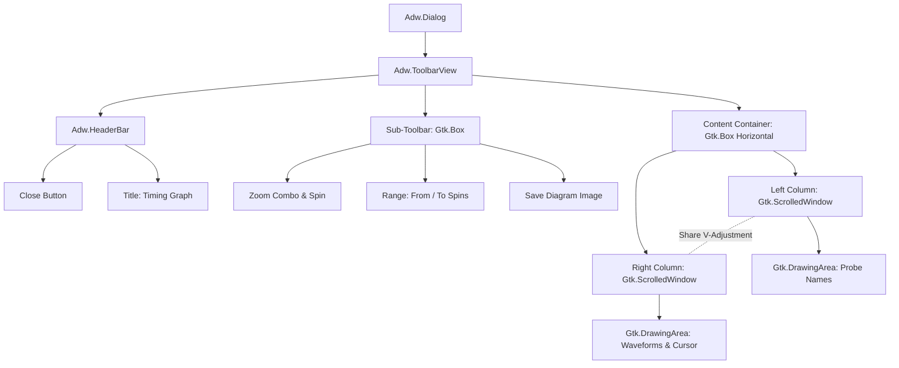

# PLAN: Timing Diagram Revamp

This document outlines the architectural analysis, design, and step-by-step migration plan for revamping GGate's Timing Diagram window. The current implementation is half-wired, uses outdated GTK3 patterns, and suffers from layout loops, heavy memory allocations, and API mismatch crashes.

> [!NOTE]
> This is a planning-only task. No application code will be modified during this step.

---

## 1. Architectural Analysis of the Current Implementation

### 1.1 Current Files & Issues
*   **[Display.py](file:///Users/ekureedem/Documents/Projects/GGate/ggate/Components/Windows/TimingGraph/Display.py)**:
    *   Subclasses `Adw.Dialog` but is instantiated with a standard window structure that lacks modern navigation, close buttons, toolbar views, and controls.
    *   Relies on the obsolete `get_visible()` method from the parent window context (which crashes since `Adw.Dialog` in GTK4/Libadwaita does not inherit from `Gtk.Window` directly and doesn't support `get_visible()`).
*   **[Diagram.py](file:///Users/ekureedem/Documents/Projects/GGate/ggate/Components/Windows/TimingGraph/Diagram.py)**:
    *   Hosts `self.name_area` and `self.chart_area` drawing areas.
    *   **Layout Loop Pitfall**: In the custom `draw()` method, it calls `set_size_request()` on the drawing areas. In GTK4, modifying widget size requests inside or during a draw event queue triggers another layout pass, causing an infinite layout loop and UI freezing.
    *   **Memory Allocation Pitfall**: It instantiates new `cairo.ImageSurface` objects of size up to `32767px` wide on *every single redraw step*. This consumes tens of megabytes of memory per frame and leads to heavy garbage collection thrashing.
    *   **HiDPI/Retina Support**: By rendering to an offscreen image surface and then blitting, the diagram ignores high-DPI scaling factors, rendering blurry lines on Retina displays.
    *   **Scrolled Window Nesting**: It subclasses `Gtk.ScrolledWindow` but then embeds *another* scrolled window (`timing_scroll_window`) inside itself, creating a redundant nested scroll container.
*   **Legacy [DiagramArea.py](file:///Users/ekureedem/Documents/Projects/GGate/ggate/DiagramArea.py) & [TimingDiagramWindow.py](file:///Users/ekureedem/Documents/Projects/GGate/ggate/TimingDiagramWindow.py)**:
    *   Used synchronised scrolled windows (`vadjustment` sharing) to freeze the left-side names column horizontally while scrolling it vertically in sync with the chart waveforms.
    *   Offered control elements (Scale zoom, units, range filters, and manual cursor spin buttons) that are completely missing in the current GTK4 dialog.

---

## 2. Data Model & Simulation Grounding

### 2.1 Waveform Data Source
All signal waveforms are extracted directly from the active simulation manager instance:
*   **History Array**: `self.circuit.probe_levels_history` in [CircuitManager.py](file:///Users/ekureedem/Documents/Projects/GGate/ggate/CircuitManager.py).
*   **Frame Structure**: Each entry in the history is a list of floats/booleans:
    `[timestamp, probe_0_state, probe_1_state, ..., probe_n_state]`
    *   `timestamp` (float): The simulated timeline time in seconds.
    *   `probe_i_state` (bool): The logic state (high/low) of the $i$-th probe.
*   **Ordering Stability**: The order of states in each frame maps strictly to the order of active Probe components returned by filtering components:
    ```python
    probes = [c for c in self.circuit.components if c[0] == "probe"]
    ```
    Since components cannot be added, deleted, or reordered while GGate is in Running Mode, this sequence remains completely static throughout the simulation run.

### 2.2 Time Navigation and Reversion
*   **Current Time**: Plotted as a red vertical cursor line matching `self.circuit.current_time`.
*   **State Travel / Scrubbing**: When the user clicks or scrubs on the chart timeline, we calculate the selected time:
    ```python
    selected_time = (clicked_x / scale) + start_time
    ```
    We write this to `self.circuit.current_time` and call `self.circuit.revert_state()`. This rolls back component logic history to that point, and triggers a redraw on the main canvas (`self.parent.drawarea`), synchronizing the schematic's visual state with the timing graph's cursor position.

### 2.3 Handling Empty Simulation History
When simulation starts, `initialize_logic()` clears the history. If no interactive switches are clicked, `probe_levels_history` remains empty.
*   **Recommendation**: In `on_circuit_run()` in `MainFrame.py`, perform an initial evaluation step to register the $t=0.0$ state.
*   **Graceful fallback**: If `probe_levels_history` is empty, the diagram drawing callbacks should render a placeholder message ("No simulation steps recorded. Operate inputs to advance simulation.") rather than crashing.

---

## 3. UI Architecture (GTK4 & Libadwaita)

A robust layout requires separating the dialog controls, the frozen name list, and the scrollable canvas.



### 3.1 Widget Layout & Hierarchy
1.  **Dialog Wrapper**: `TimingGraphDisplayWindow` subclasses `Adw.Dialog`.
    *   Use a tracking attribute `self._is_presented` (toggled via `closed` signals) to safely guard refresh loops instead of using deprecated `get_visible()`.
2.  **Chrome Structure**: Set child of the dialog to an `Adw.ToolbarView`.
    *   **Top Bar**: `Adw.HeaderBar` containing the title.
    *   **Sub-Toolbar**: A horizontal `Gtk.Box` containing:
        *   Zoom/Scale inputs (pixels/sec value + unit dropdown).
        *   Range inputs (From spinbutton, To spinbutton, with shared unit selector).
        *   Save button (calling `save_timing_diagram_as_image()`).
    *   **Content**: A horizontal layout box containing `name_scroll` and `diagram_scroll`.

### 3.2 Vertical Scroll Synchronization
To keep the probe names lined up with their waveforms while allowing horizontal timeline scrolling:
*   Pass the vertical adjustment of `diagram_scroll` to `name_scroll`:
    ```python
    name_scroll.set_vadjustment(diagram_scroll.get_vadjustment())
    ```
*   Set scrolling policies so scrollbars only render on the main waveform area:
    ```python
    name_scroll.set_policy(Gtk.PolicyType.NEVER, Gtk.PolicyType.NEVER)
    diagram_scroll.set_policy(Gtk.PolicyType.AUTOMATIC, Gtk.PolicyType.AUTOMATIC)
    ```

### 3.3 Drawing Area Logic (GTK4 Best Practices)
To prevent layout loops, drawing areas must be pure renderers:
*   **Size Request (Triggered on data/scale change)**:
    *   Add an explicit `update_layout_sizes()` helper that calculates the necessary total height ($40 \text{ px} \times \text{number of probes} + \text{padding}$) and width ($(\text{end\_time} - \text{start\_time}) \times \text{scale}$).
    *   Call `set_size_request()` on the DrawingAreas *only* inside this helper when parameters change. **Never** call `set_size_request` within draw callbacks.
*   **Pure Rendering Callbacks**:
    *   Configure `set_draw_func(self.name_area_draw_fn)` and `set_draw_func(self.chart_area_draw_fn)`.
    *   Draw directly on the `cairo.Context` passed to these functions. This respects GTK4 double buffering, scales with high-DPI factors, and avoids any manual `ImageSurface` allocation.

### 3.4 Interaction & Gestures
Replace GTK3 event masks with GTK4 EventControllers:
*   **Scrubbing/Clicking**: `Gtk.GestureClick` on the chart DrawingArea. Clicking updates the current time, triggers state reversion, and schedules redraws on both the timing canvas and main schematic canvas.
*   **Hovering Cursor**: `Gtk.EventControllerMotion` tracks the cursor position to draw a light vertical guide line.

---

## 4. Rewrite vs. Salvage Recommendation

**Strong Recommendation**: **Clean rewrite** of both `Display.py` and `Diagram.py` from scratch.

### Rationale
1.  **Outdated Double-Buffering**: The existing code mimics an old GTK3 design by allocating physical offscreen `cairo.ImageSurface` buffers. In GTK4, double-buffering is native, and this manual cache logic causes layout recursion and excessive memory churn.
2.  **API Drift**: The wrapper lacks sub-toolbars, navigation controls, and uses methods like `get_visible` that are missing or behave differently on libadwaita dialog wrappers.
3.  **Layout Synchronization**: Salvaging the nested scrolls in `Diagram.py` will lead to scroll conflicts. Syncing adjustments directly on two side-by-side scrolled windows is cleaner and less error-prone.
4.  **HiDPI**: Drawing directly onto GTK's native draw context guarantees crisp rendering across modern displays.

---

## 5. Phased Implementation Steps

### Phase 1: Dialog Shell Rewrite (`Display.py`)
1.  Re-write `TimingGraphDisplayWindow` as an `Adw.Dialog` containing an `Adw.ToolbarView`.
2.  Add sub-toolbar widgets: Scale / Zoom input row, Range From/To inputs, and Save button.
3.  Configure `_is_presented` state tracking and hook close action signals.

### Phase 2: Scrollable Layout & Size Calculation (`Diagram.py`)
1.  Implement `TimingGraphDiagram` as a `Gtk.Box` containing two scrolled windows sharing the vertical adjustment.
2.  Implement `update_layout_sizes()` to request sizes based on active Probes count and horizontal scale factor.
3.  Hook up basic DrawingArea draw callbacks showing dummy shapes to verify layout and scrolling.

### Phase 3: Waveform Cairo Rendering
1.  Wire up `name_area_draw_fn` to read active Probes and print their names in aligned divisions.
2.  Wire up `chart_area_draw_fn` to read `self.circuit.probe_levels_history` and draw graduation lines.
3.  Render digital transitions (high/low logic levels) for each probe sequence across the timeline.

### Phase 4: Interaction and Time Travel
1.  Add `Gtk.GestureClick` and `Gtk.EventControllerMotion` to the waveform drawing area.
2.  Implement hovering guide cursor and active scrubbing.
3.  Hook up cursor selection to `self.circuit.revert_state()` and trigger main schematic redraws.

### Phase 5: Zoom, Units, and Image Export
1.  Connect the scale and range widgets in `Display.py` to update diagram properties and trigger size updates.
2.  Expose expected attributes/methods (`diagram_width`, `name_width`, `img_height`, `draw_names()`, `draw_diagrams()`) to ensure full compatibility with the existing [Exporter.py](file:///Users/ekureedem/Documents/Projects/GGate/ggate/Exporter.py) image saver.

---

## 6. Open Questions for the PM

1.  **Auto-Scrolling**: When simulation is running, should the timing diagram automatically scroll horizontally to follow the latest simulated timestamp?
2.  **Open/Short Circuit States**: In the event of a simulation fault (open circuit `-1` or short circuit), should the timing diagram display a special diagnostic line style (e.g. dashed red line) or simply stop drawing?
3.  **Default Timeline Limits**: Should the timeline range default to the maximum calculation duration (`0.0002` s / 200 µs), or should it grow dynamically if the duration preference is updated?

---

## 7. Draw-Area Redesign (post-implementation fixes)

### 7.1 Layout / Expansion Fix

The chart collapsed to ~115 px because neither the `Gtk.Box` (TimingGraphDiagram) nor its scrolled windows had expand flags set. Fix:

- `TimingGraphDiagram` (`Gtk.Box`): `set_hexpand(True)`, `set_vexpand(True)` so the ToolbarView content area stretches it.
- `name_scroll`: `set_hexpand(False)`, `set_vexpand(True)` — fixed width, tracks height.
- `diagram_scroll`: `set_hexpand(True)`, `set_vexpand(True)` — fills all remaining width and height.
- `chart_area` DrawingArea: `set_hexpand(True)` so it expands within its scrolled window viewport; horizontal scroll only when `diagram_width` exceeds viewport.

Row Y math must be identical between `draw_names` and `draw_diagrams`:
- Ruler strip: rows 0–39 (40 px tall).
- Probe row `j`: y-range `40 + j*40` … `40 + j*40 + 39`. Total height: `40 + n_probes * 40`.
- Separator line at `40 + j*40 + 39.5` (between rows).
- Probe label vertically centred at `40 + j*40 + 20` (mid-row).
- Waveform HIGH at `y = 40 + j*40 + 10 + 0.5`; LOW at `y = 40 + j*40 + 30 + 0.5`.

### 7.2 Theme-Aware Color Mapping (Preference keys)

All `set_source_rgb` / `set_source_rgba` literals are replaced with `cr.set_source(Preference.<key>)`. Since `Preference` values are `cairo.SolidPattern` objects, they work identically from the Exporter (no widget context needed). Cross-reference `.agents/plans/theming.md` — these are the same keys that theming.md will update per palette.

| Surface | Preference key |
|---------|---------------|
| Background fill (names + chart) | `bg_color_running` |
| Probe names + ruler labels (text) | `component_color_running` |
| Row separators, panel border, ruler divider, graduation lines | `grid_color` |
| Waveform HIGH segments | `highlevel_color` |
| Waveform LOW segments | `lowlevel_color` |
| Current-time cursor | `terminal_color` |
| Hover guide line | `cursor_color` |
| Empty-history placeholder text | `component_color_running` |

### 7.3 Visual Design

- **Ruler strip** (top 40 px): background `bg_color_running`; bottom separator in `grid_color`; start/end labels + graduation labels in `component_color_running`; graduation tick lines in `grid_color`.
- **Name column rows**: background `bg_color_running`; separator lines `grid_color`; probe labels left-aligned, vertically centred, `component_color_running`.
- **Waveform rows**: background `bg_color_running`; HIGH segment `highlevel_color`; LOW segment `lowlevel_color`; 1.5 px line weight.
- **Cursors**: current-time `terminal_color` 1 px (drawn after `draw_diagrams`); hover guide `cursor_color` 1 px (only when `show_cursor`).
- No hardcoded white, grey, or black anywhere in the on-screen draw path.
