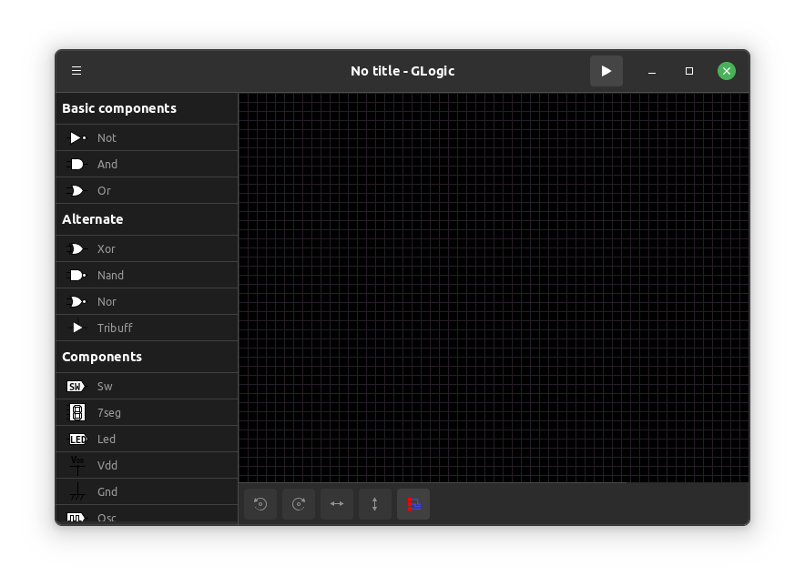

# GGate (fork of GLogic)


A logic gate simulator for linux developed with Gtk and python.

## Requirements

This application requires any linux environment on which **GTK4** is installed. Or **Ubuntu ^22.10** on windows using **WSL**

## Features

* Includes Tri State Buffer
* LED and 7 segment for state viewing
* Easy to understand UI and accesible shortcuts
* Contains all logic gates with appropriate diagrams and alternative (IEC, MIL/ANSI)
* Supports Simulation and Timing Diagrams
* Support exporting of drawings and timing diagrams.
* Variable component properties
* Contains all types Flip Flop
* Has display contents like LED, 7 Segments etc
* File handling support

Check out the latest changelog on GGate [here.](./NEWS) and [future plans](./TODO)

## Installation

To run without installing
```bash
python3 run.py
```

GGate will soon be available on snapcraft, flatpak and normal apt. View [installation](./INSTALL.md) for more details

## Screenshots

### Main window



### Tool Bar


## Contribution

GGate is open to any contributions and translation aid.

### How To Contribute

Fork this repo, make your edits and submit a pull request

## Donation

GGate project is open to funding and donation support.

[](https://sourceforge.net/projects/ggate/files/latest/download)
