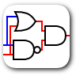
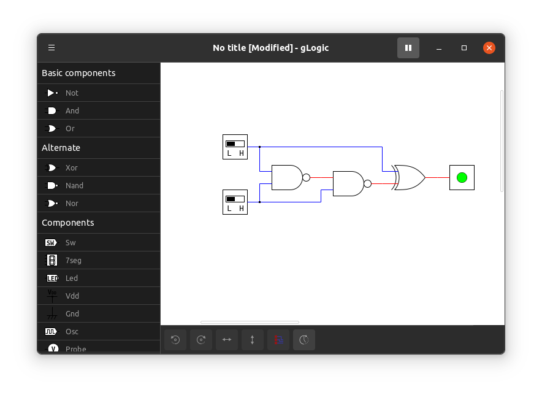

# GLogic

A logic gate simulator for linux developed with Gtk and python.

## Features

* LED and 7 segment for state viewing
* Easy to understand UI and accesible shortcuts
* Contains all logic gates with appropriate diagrams and alternative (IEC, MIL/ANSI)
* Supports Simulation and Timing Diagrams
* Support exporting of drawings and timing diagrams.
* Variable component properties
* Contains all types Flip Flop
* Has display contents like LED, 7 Segments etc
* File handling support

## Installation

GLogic can be installed via snap or apt. View [installation](./INSTALL.md) for more details

## Screenshots

### Main window

### Tool Bar

## Contribution

GLogic is open to any contributions and translation aid.

### How To Contribute

Fork this repo, make your edits and submit a pull request

## Donation

GLogic project is open to funding and donation support.
