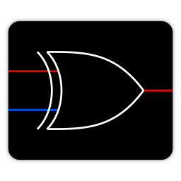
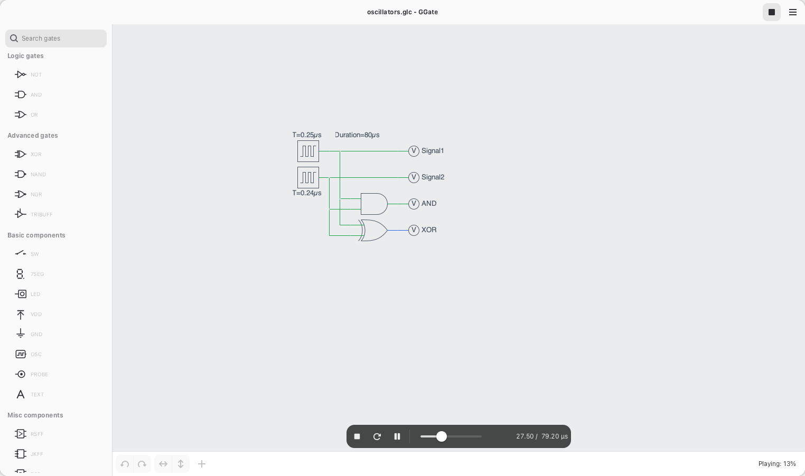
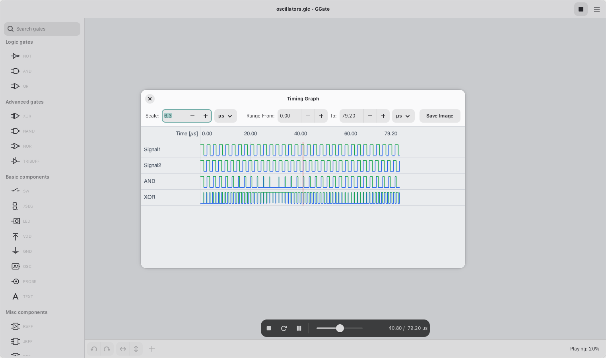
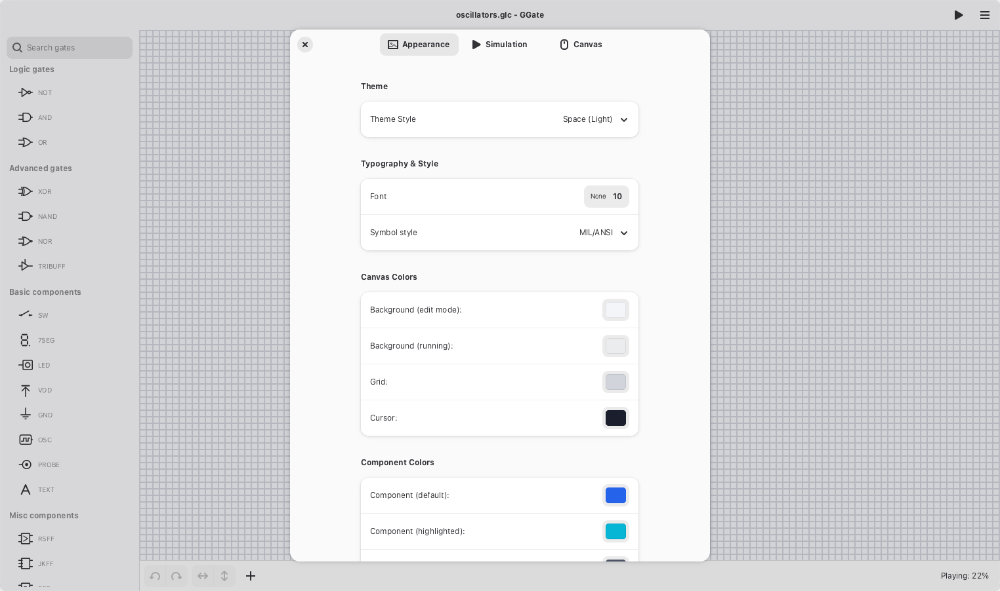
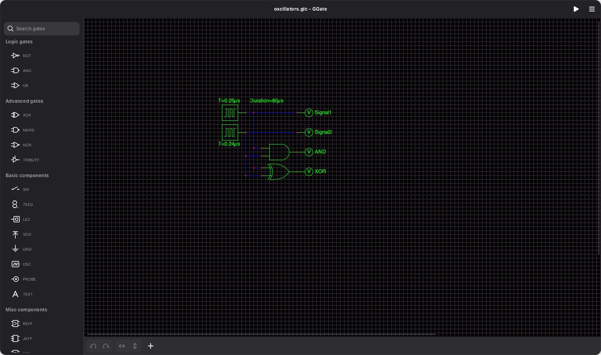
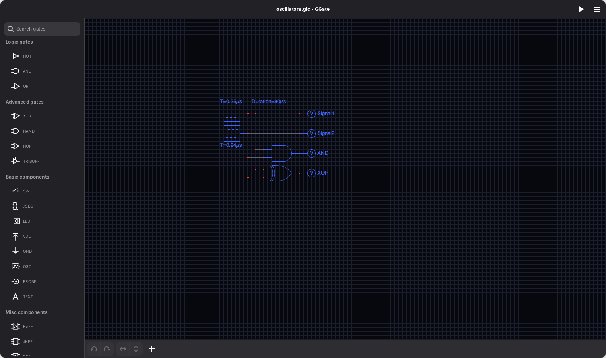
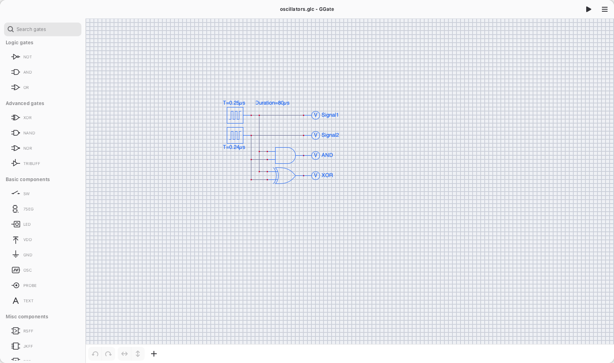

# GGate (fork of GLogic)



A logic-circuit simulator for Linux, built with **Python**, **GTK 4** and **libadwaita**.
Place logic gates and components on a Cairo-rendered canvas, wire them into nets, run the
simulation, and watch the circuit evolve.

[](./gallery/ggate-demo.mp4)

▶ [Watch the 30s demo](./gallery/ggate-demo.mp4) — or browse the full [gallery](./gallery).

## Features

* All standard logic gates, with both **IEC** and **MIL/ANSI** symbol sets
* Flip-flops, counters, shift registers (SISO/SIPO/PISO/PIPO) and a tri-state buffer
* State viewers — LEDs and a 7-segment display
* Interactive switches and a clock oscillator
* **Simulation** with an animated, **record-then-play** playback and a floating transport bar
  (stop, restart, play/pause, seek, live sim-time)
* **Timing diagrams** for the simulated signals
* Export drawings and timing diagrams (PNG / PDF / PS / SVG)
* Per-component editable properties
* Light/dark theming (Classic, Space, Frappé, Mocha)
* Open/save circuits as `.glc` files

See the [changelog](./CHANGELOG.md) for recent changes and the [roadmap](./TODO) for what's planned.

## Screenshots

| Timing diagram | Preferences |
|---|---|
|  |  |

Themes ship in light and dark variants:

| Classic | Space (Dark) | Mocha (Light) |
|---|---|---|
|  |  |  |

More previews live in [`gallery/`](./gallery).

## From v1 to v5

GGate began life in 2012 as **GLogic**, a wxWidgets desktop app. It has since been rebuilt into
a modern GNOME application:

* **v1 (2012)** — initial release; basic gates, oscillator, probe, timing chart.
* **v2 (2012)** — migrated wxWidgets → GTK+; added the property window, IEC symbols and preferences.
* **v3 (2022)** — ported to **GTK 4**, added the tri-state buffer and shift registers.
* **v4 (2023)** — renamed to GGate for publishing; revamped the timing dialog.
* **v5 (2026)** — libadwaita throughout, a themed component icon set (ANSI + IEC) with light/dark
  themes, a meson build with CI, and **animated record-then-play simulation** with a floating
  transport bar and live recompute on edits.

## Requirements

* Python `>= 3.10`
* GTK `>= 4.16`, libadwaita `>= 1.6.8`
* Python packages: `pygobject`, `pycairo`, `python-igraph`, `shapely`, `packaging`

## Running

To run from source without installing:

```bash
python3 run.py
```

To open a circuit on launch, pass a `.glc` file (examples live in [`data/examples/`](./data/examples)):

```bash
python3 run.py data/examples/oscillators.glc
```

Packaged builds (Snap, Flatpak, and meson install) are in progress — see [INSTALL.md](./INSTALL.md).

## Contributing

Contributions and translation help are welcome. Fork the repository, make your changes, and
open a pull request.
