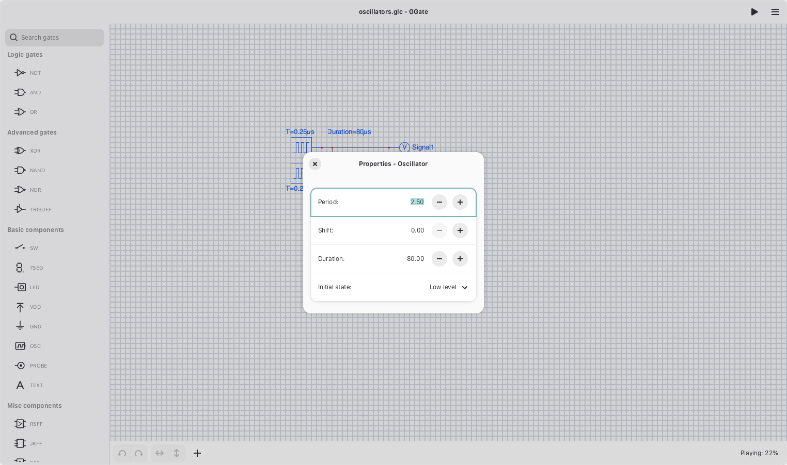
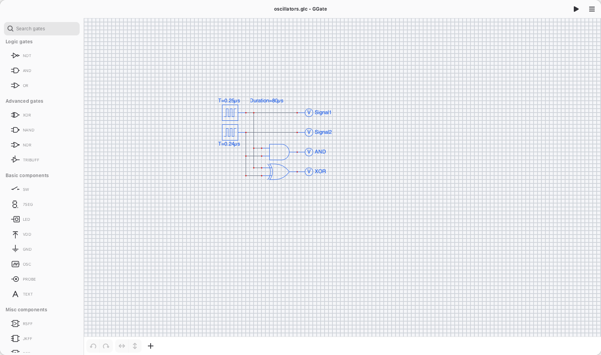
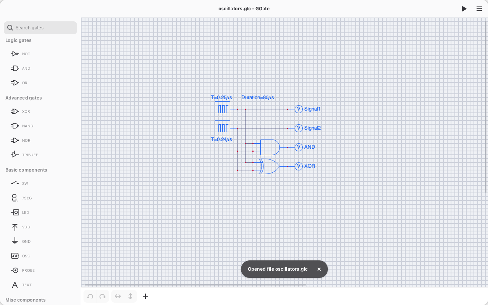
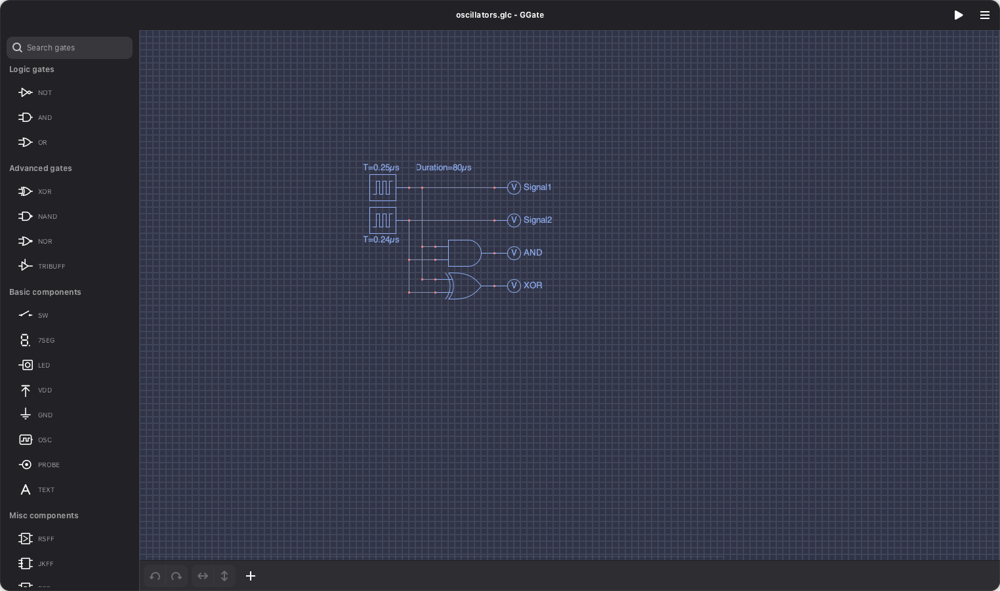
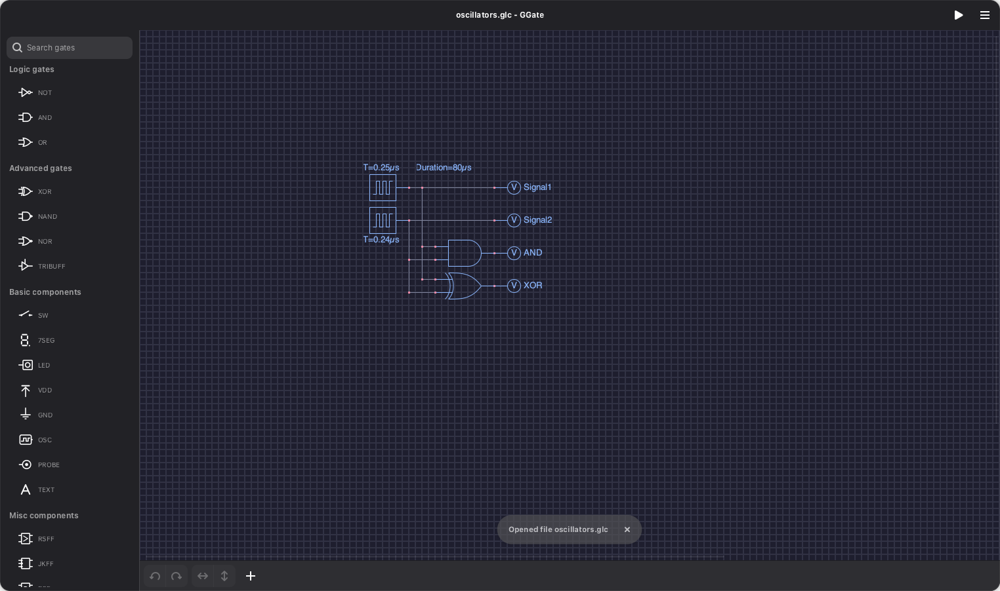

# GGate gallery

Previews of GGate. The stills are captured procedurally:

```bash
python3 build-aux/capture_screenshots.py   # the stills below
```

The demo clip is a screen recording cleaned up with ffmpeg (1080p, 30fps, 30s).

## Demo

A short tour — opening properties, changing an LED's colour, running the simulation:

[](./ggate-demo.mp4)

▶ [ggate-demo.mp4](./ggate-demo.mp4)

## Simulation


## Timing diagram


## Dialogs

| Preferences | Component properties |
|---|---|
|  |  |

## Themes

Each theme ships in light and dark variants; the libadwaita chrome matches the variant.

**Classic**


**Space (Light)**



**Space (Dark)**


**Frappé (Light)**



**Frappé (Dark)**



**Mocha (Light)**


**Mocha (Dark)**


